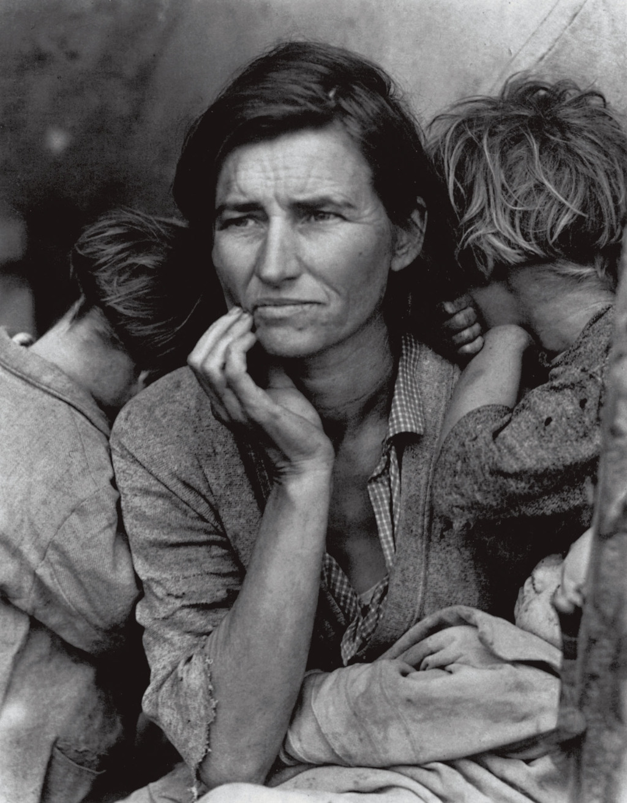

# Estudios sobre la pobreza

**La casen del 2020** trae dos particularidades:
1 en vez de ceros, trae NAs, al contrario de todas las demas casen\
2 no tiene campo alfabetismo, que construimos a partir de una regresión lineal en el repositorio:
**ds_estimacion_con_RL_de-analf_2020**\
3 la tabla corregida queda en **casen_2020_c.rds**
***

# 1 Carpeta: **pobreza_nueva_metodologia** 

1.1 Existe un programa **pobreza_NM.Rmd**, el cual
identifica un supuesto error que se observa en las publicaciones oficiales de pobreza, el
que se produce al ser aplicada una nueva metodologia (asociada con la crisis subprime y la cantidad de pobres en vez de aumentar, descienden).

Para ello tuvimos que utilizar las bases de datos:

1. Ingresos MN 2006.sav
2. Ingresos MN 2009.sav
3. Ingresos MN 2011.sav
4. casen_2013_ymt.dta

Las tablas dicen Ingresos pero son las encuestas completas.

Aplicando nuestros analisis con estas bases de datos coincidimos con la data publicada oficial.

1.2 Existe un programa **pobreza_NM_interpolacion.Rmd**

1.3 Existe un **prueba_ing_ttcc**

***
El programa más importante que recoge Casens corregidas y establece porcentajes de pobreza por comuna 
de a cuerdo a la nueva metodologia es **pobreza_NM**
***

Que internet está en:

https://rpubs.com/dataintelligence/ttcc_pobreza_NM_interpolacion
