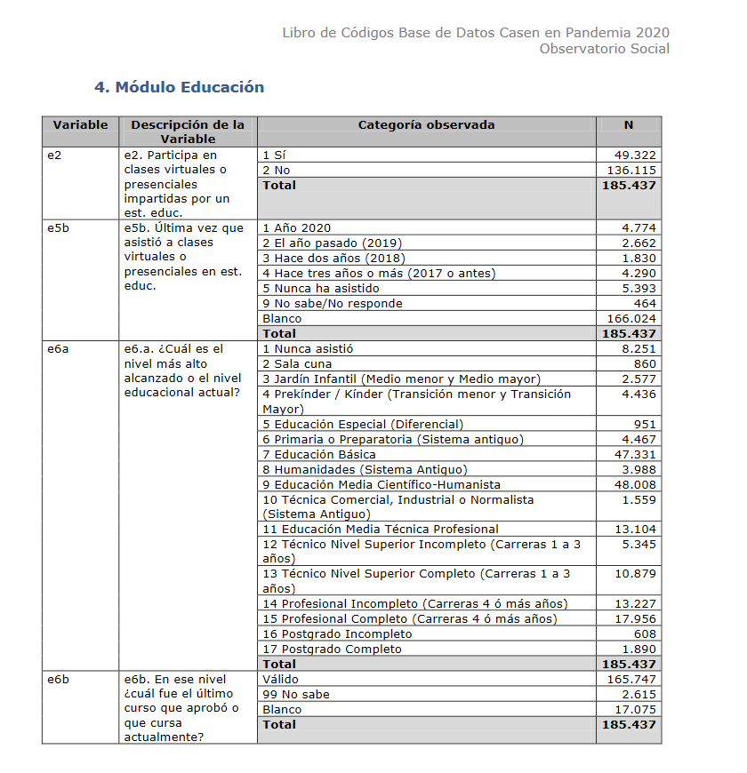

date: `r format(Sys.time(), "%d-%m-%Y")`

<style type="text/css">
.main-container {
  max-width: 1600px;
  margin-left: 100px;
  margin-right: auto;
}
</style>

```{r setup, include=FALSE}
knitr::opts_chunk$set(echo = TRUE)
library(ggplot2)
library(ggpubr)
library(markdown)
library(shiny)
library(shinythemes)
library(tidyverse)
library(magrittr)
library(lubridate)
library(plotly)
library(xts)
library(dygraphs)
library(kableExtra)
library(knitr)
library("readxl")
library(rsconnect)
library(dplyr)
library(summarytools)
library(epiDisplay)
#library(leaflet)
library(haven)
library(epiDisplay)
library("readxl")
library(hrbrthemes)
library(viridis)
library(viridisLite)
library(writexl)
library(plyr)
library(kableExtra)
library(knitr)
library(DescTools)
library(foreign)
library(DT)

# https://www.datacamp.com/community/tutorials/contingency-tables-r

oldw <- getOption("warn")
options(warn = -1)
```


# Aspectos conceptuales

## La metodología de estimación de la Pobreza en la Casen.

Desde la década de 1980 y hasta la actualidad, en Chile la medición de la situación de
pobreza de los hogares se ha realizado utilizando una metodología basada en ingresos.
Según ésta, un hogar se ha considerado en situación de pobreza extrema si sus ingresos
totales per cápita mensuales no son suficientes para financiar el valor de la denominada
canasta de necesidades básicas alimentarias (NBA). En esta metodología tradicional, el valor
de la NBA es la línea de pobreza extrema o indigencia. En tanto, se entiende que el hogar
está en situación de pobreza si sus ingresos totales per cápita mensuales no le permiten
cubrir sus necesidades básicas alimentarias y no alimentarias (el valor de la canasta básica
alimentaria y no alimentaria es la línea de pobreza).

La composición de la canasta básica alimentaria de la Metodología Tradicional de medición
de pobreza fue definida sobre la base de los patrones de consumo de los hogares,
registrados en la Encuesta de Presupuestos Familiares 1986-1987 del Instituto Nacional de
Estadísticas (INE).

Los ingresos de los hogares han sido estimados utilizando los datos de la
Encuesta de Caracterización Socioeconómica Nacional (Casen), de responsabilidad del
Ministerio de Desarrollo Social (ex Ministerio de Planificación). 

En el periodo 1987-2011 los datos de ingreso utilizados para la estimación de la tasa de pobreza han sido
validados, corregidos por no respuesta y ajustados a Cuentas Nacionales por la Comisión
Económica para América Latina y el Caribe (CEPAL). Adicionalmente, CEPAL
tradicionalmente ha validado y editado los subsidios monetarios de monto fijo que no han
sido declarados con exactitud por los encuestados.


El año 2013 se preparó e implementó el levantamiento de la encuesta Casen 2013. Como
parte de este proceso, se ha llevado a cabo una actualización y perfeccionamiento de la
metodología de medición de la pobreza.


## Pobreza absoluta versus pobreza relativa. Aspectos técnicos.

Los indicadores de pobreza y pobreza extrema estimados por Ministerio de Desarrollo Social a partir de la información de la Encuesta Casen utilizan el método de ingresos o indirecto. La utilización de esta misma metodología desde 1987 ha permitido la construcción de indicadores comparables a lo largo del tiempo, haciendo posible de esta manera evaluar su evolución. Además, su amplia aplicación a nivel internacional, permite la comparación de la situación nacional con la de otros países.

Este método, al igual que el método directo o de necesidades básicas insatisfechas, NBI, mide pobreza y pobreza extrema en términos absolutos. Esto es, los límites entre quiénes son pobres o indigentes y quiénes no lo son se definen en relación a mínimos de satisfacción de necesidades básicas, en el caso de la pobreza, o alimentarias, en el caso de la pobreza extrema.

A diferencia del método de NBI, este método utiliza el ingreso como indicador de la capacidad de satisfacción de las necesidades básicas, de modo que estos mínimos se establecen en términos de un cierto nivel de ingreso. Así, la línea de pobreza es el ingreso mínimo establecido por persona para satisfacer las necesidades básicas y la línea de pobreza extrema es el mínimo establecido por persona para satisfacer las necesidades alimentarias.

De acuerdo con ello, se considera en situación de pobreza a aquellos hogares cuyos ingresos son inferiores al mínimo establecido para satisfacer las necesidades básicas de sus miembros, y en situación de pobreza extrema a aquellos hogares cuyos ingresos son inferiores al mínimo establecido para satisfacer las necesidades alimentarias de sus miembros.

Para la clasificación de los hogares en estas categorías, el ingreso del hogar se define como la suma del ingreso autónomo del hogar, las transferencias monetarias que recibe el hogar del Estado y una imputación por concepto de arriendo de la vivienda, cuando ésta es habitada por sus propietarios. 

En términos generales, es posible distinguir dos perspectivas de medición de la pobreza, los
enfoques subjetivo y objetivo. En el enfoque subjetivo, la situación de pobreza se define a
partir de la percepción que tienen los propios individuos, ya sea personas u hogares, de su
situación; en tanto, en el enfoque objetivo, la situación de pobreza se define de acuerdo a
criterios comunes establecidos externamente, que utilizan información recogida sobre los
individuos.
A su vez, dentro del enfoque objetivo, se puede distinguir entre las mediciones de pobreza
absoluta y las mediciones de pobreza relativa. Mientras los métodos de medición de pobreza
absoluta consideran que hay umbrales absolutos de satisfacción de las necesidades básicas
de los individuos (y definen el límite de la situación de pobreza en relación a estos mínimos),
los métodos de medición de pobreza relativa consideran que un individuo se encuentra en
situación de pobreza cuando está en desventaja respecto a los individuos que conforman la
sociedad de la que es parte (y definen el límite para la situación de pobreza en relación a
indicadores del bienestar del conjunto de la sociedad).


"Con el objetivo de analizar de manera simultánea y rigurosa un conjunto de dimensiones
pertinentes al estudio de la pobreza, el desarrollo de una medida multidimensional de la
pobreza requiere adoptar decisiones metodológicas fundamentadas tanto desde un punto de
vista técnico como normativo. Reconociendo esta complejidad, la metodología propuesta por
Alkire y Foster (2007) constituye uno de los principales esfuerzos desarrollados en las
últimas décadas y es el referente de base para la construcción de una metodología aplicable
al caso de Chile."


## Pobreza por ingresos

Todas las Casen (años 2006, 2009, 2011, 2013, 2015 y 2017)  contienen una sola variable que discrimina la categoría de pobreza en la que cada observación es clasificada. Las categorías son tres, las que si bien se denominan de distinto modo a partir del año 2013, identifican lo mismo:

Hasta el 2011:

1. Indigente
2. Pobre no indigente
3. No pobre

A partir del 2013, “MN” a nueva metodología que incluye nuevas líneas de pobreza y nueva
metodología de datos de ingresos.


Desde el 2013:

1. Pobres extremos
2. Pobres no extremos
3. No pobres      	

|                  |   2006	            |   2009	         |   2011	       |   2013        	     |  2015              |   2017	                                 |   2020                 |    homologación           |
|---	             |---	                  |---       	         |---            |---	                 |---                 |---     	                             | ---                    |        ---                   |
|Variable          | **CORTE**                | **CORTE**              | **corte**         | **pobreza_MN**          | **pobreza**       	  | **pobreza**  	     | **pobreza**            |                           |
|---	             |---	                  |---       	         |---            |---	                 |---                 |---   	                               |    ---                 |        ---                   |
|Categorías        | Indigente       	| Indigente      	   | Pobreza extrema 	 | Pobres extremos     | Pobres extremos    | Pobres extremos                          |  Pobres extremos       |       pobre extremo       |
|                  | Pobre no indigente  	| Pobre no Indigente | Pobre  	 | Pobres no extremos  | Pobres no extremos | Pobres no extremos                       |   Pobres no extremos   |       pobre               |
|                  | No pobre       	| No pobre     	   | No pobre  	 | No pobres   	     | No pobres          | No pobres                           |    No pobres  |       no pobre            |


## Pobreza multidimensional

|                            |   2013        	     |  2015              |   2017	           |
|---	                       |---	                 |---                 |---     	           |
|Variable                    | **pobreza_multi**        | **pobreza_multi_4d**   | **pobreza_multi_4d**   |
|                            |                      | **pobreza_multi_5d**   | **pobreza_multi_5d**   |
|---	                       |---	                 |---                 |---   	           |
|Categorías                  | no pobre             | no pobre           | no pobre           |
|                            | pobre                | pobre              | pobre              |

La variable: pobreza_multi_5d,  "Situación de pobreza multidimensional" considera la dimensión: "Entorno y Redes".


# Estudio sobre etnia e inmigrantes

## Parte I: Etnia

```{r, warning=FALSE, message=FALSE}
# Como humanos, preferimos trabajar con etiquetas que con códigos.
dataset2006 <- readRDS("../../archivos_grandes/casen_2006_c.rds")
dataset2006  <- as_factor(dataset2006, only_labelled = TRUE)
dataset2009  <- readRDS("../../archivos_grandes/casen_2009_c.rds")
dataset2009  <- as_factor(dataset2009, only_labelled = TRUE)
dataset2011  <- readRDS("../../archivos_grandes/casen_2011_c.rds")
dataset2011  <- as_factor(dataset2011, only_labelled = TRUE)
dataset2013  <- readRDS("../../archivos_grandes/casen_2013_c.rds")
dataset2013  <- as_factor(dataset2013, only_labelled = TRUE)
dataset2015 <- readRDS("../../archivos_grandes/casen_2015_c.rds")
dataset2015  <- as_factor(dataset2015, only_labelled = TRUE)
dataset2017  <- readRDS("../../archivos_grandes/casen_2017_c.rds")
dataset2017  <- as_factor(dataset2017, only_labelled = TRUE)
dataset2020 <- read.spss("../../archivos_grandes/casen_2020.sav", to.data.frame=TRUE)
```


### 2006

```{r}
ab <- dataset2006
b <- ab$COMUNA
x <- ab$E1
c <- ab$CORTE
d <- ab$T4
e <- ab$SEXO

cross_tab =  xtabs(ab$EXPC ~  unlist(b)  + unlist(x) + unlist(c)  + unlist(d) + unlist(e),aggregate(ab$EXPC ~   unlist(b)  + unlist(x) + unlist(c) + unlist(d) + unlist(e) ,ab,mean))
tabla <- as.data.frame(cross_tab)
d <-tabla[!(tabla$Freq == 0),]
d$anio <- "2006"
    
names(d)[1] <- "comuna"   
names(d)[2] <- "Alfabetismo"
names(d)[3] <- "Pobreza"
names(d)[4] <- "Etnia"
names(d)[5] <- "Sexo"
names(d)[6] <- "Frecuencia"
names(d)[7] <- "Año"

codigos_comunales <- readRDS(file = "../../archivos_grandes/codigos_comunales_2006.rds")
names(codigos_comunales)[1] <- "código"
names(codigos_comunales)[2] <- "comuna"

df_2006 = merge( x = d, y = codigos_comunales, by = "comuna", all.x = TRUE)

datatable(df_2006, extensions = 'Buttons', escape = FALSE, rownames = FALSE,
          options = list(dom = 'Bfrtip',
          buttons = list('colvis', list(extend = 'collection',
          buttons = list(
          list(extend='copy'),
          list(extend='excel',
            filename = 'hitStats'),
          list(extend='pdf',
            filename= 'hitStats')),
          text = 'Download')), scrollX = TRUE))
```


```{r}
unique( df_2006$Alfabetismo)
```


```{r}
unique( dataset2015$e1)
```


### 2009

```{r}
ab <- dataset2009
b <- ab$COMUNA
x <- ab$E1
c <- ab$CORTE
d <- ab$T5
e <- ab$SEXO

cross_tab =  xtabs(ab$EXPC ~  unlist(b)  + unlist(x) + unlist(c)  + unlist(d) + unlist(e),aggregate(ab$EXPC ~   unlist(b) + unlist(x)  + unlist(c) + unlist(d) + unlist(e) ,ab,mean))
tabla <- as.data.frame(cross_tab)
d <-tabla[!(tabla$Freq == 0),]
d$anio <- "2009"
    
names(d)[1] <- "comuna"     
names(d)[2] <- "Alfabetismo"
names(d)[3] <- "Pobreza"
names(d)[4] <- "Etnia"
names(d)[5] <- "Sexo"
names(d)[6] <- "Frecuencia"
names(d)[7] <- "Año"

codigos_comunales <- readRDS(file = "../../archivos_grandes/codigos_comunales_2009.rds")
names(codigos_comunales)[1] <- "código"
names(codigos_comunales)[2] <- "comuna"

df_2009 = merge( x = d, y = codigos_comunales, by = "comuna", all.x = TRUE)

head(df_2009,10)
```


### 2011

```{r}
ab <- dataset2011
b <- ab$comuna
x <- ab$e1
c <- ab$corte
d <- ab$r6
e <- ab$sexo

cross_tab =  xtabs(ab$expc_full ~  unlist(b)  + unlist(x) + unlist(c)  + unlist(d) + unlist(e),aggregate(ab$expc_full ~   unlist(b) + unlist(x) + unlist(c) + unlist(d) + unlist(e) ,ab,mean))
tabla <- as.data.frame(cross_tab)
d <-tabla[!(tabla$Freq == 0),]
d$anio <- "2011"
    
names(d)[1] <- "comuna"     
names(d)[2] <- "Alfabetismo"
names(d)[3] <- "Pobreza"
names(d)[4] <- "Etnia"
names(d)[5] <- "Sexo"
names(d)[6] <- "Frecuencia"
names(d)[7] <- "Año"

codigos_comunales <- readRDS(file = "../../archivos_grandes/codigos_comunales_2011-2017.rds")
names(codigos_comunales)[1] <- "código"
names(codigos_comunales)[2] <- "comuna"

df_2011 = merge( x = d, y = codigos_comunales, by = "comuna", all.x = TRUE)
head(df_2011,10)
```


### 2013

```{r}
ab <- dataset2013
b <- ab$comuna
x <- ab$e1
c <- ab$pobreza_MN
d <- ab$r6
e <- ab$sexo

cross_tab =  xtabs(ab$expc ~  unlist(b) + unlist(x) + unlist(c)  + unlist(d) + unlist(e),aggregate(ab$expc ~   unlist(b)  + unlist(x) + unlist(c) + unlist(d) + unlist(e) ,ab,mean))
tabla <- as.data.frame(cross_tab)
d <-tabla[!(tabla$Freq == 0),]
d$anio <- "2013"
    
names(d)[1] <- "comuna"   
names(d)[2] <- "Alfabetismo"
names(d)[3] <- "Pobreza"
names(d)[4] <- "Etnia"
names(d)[5] <- "Sexo"
names(d)[6] <- "Frecuencia"
names(d)[7] <- "Año"

codigos_comunales <- readRDS(file = "../../archivos_grandes/codigos_comunales_2011-2017.rds")
names(codigos_comunales)[1] <- "código"
names(codigos_comunales)[2] <- "comuna"

df_2013 = merge( x = d, y = codigos_comunales, by = "comuna", all.x = TRUE)
head(df_2013,10)
```


### 2015

```{r}
ab <- dataset2015
b <- ab$comuna
x <- ab$e1
c <- ab$pobreza
d <- ab$r3
e <- ab$sexo

cross_tab =  xtabs(ab$expc_todas ~  unlist(b) + unlist(x) + unlist(c)  + unlist(d) + unlist(e),aggregate(ab$expc_todas ~   unlist(b) + unlist(x) + unlist(c) + unlist(d) + unlist(e) ,ab,mean))
tabla <- as.data.frame(cross_tab)
d <-tabla[!(tabla$Freq == 0),]
d$anio <- "2015"
    
names(d)[1] <- "comuna"     
names(d)[2] <- "Alfabetismo"
names(d)[3] <- "Pobreza"
names(d)[4] <- "Etnia"
names(d)[5] <- "Sexo"
names(d)[6] <- "Frecuencia"
names(d)[7] <- "Año"

codigos_comunales <- readRDS(file = "../../archivos_grandes/codigos_comunales_2011-2017.rds")
names(codigos_comunales)[1] <- "código"
names(codigos_comunales)[2] <- "comuna"

df_2015 = merge( x = d, y = codigos_comunales, by = "comuna", all.x = TRUE)
head(df_2015,10)
```


### 2017

```{r}
ab <- dataset2017
b <- ab$comuna
x <- ab$e1
c <- ab$pobreza
d <- ab$r3
e <- ab$sexo

cross_tab =  xtabs(ab$expc ~  unlist(b)  + unlist(x) + unlist(c)  + unlist(d) + unlist(e),aggregate(ab$expc ~   unlist(b)  + unlist(x) + unlist(c) + unlist(d) + unlist(e) ,ab,mean))
tabla <- as.data.frame(cross_tab)
d <-tabla[!(tabla$Freq == 0),]
d$anio <- "2017"
    
names(d)[1] <- "comuna"  
names(d)[2] <- "Alfabetismo"
names(d)[3] <- "Pobreza"
names(d)[4] <- "Etnia"
names(d)[5] <- "Sexo"
names(d)[6] <- "Frecuencia"
names(d)[7] <- "Año"

codigos_comunales <- readRDS(file = "../../archivos_grandes/codigos_comunales_2011-2017.rds")
names(codigos_comunales)[1] <- "código"
names(codigos_comunales)[2] <- "comuna"

df_2017 = merge( x = d, y = codigos_comunales, by = "comuna", all.x = TRUE)
head(df_2017,10)
```


### 2020


Por una extraña razón, siendo que más de medio millón de chilenos son analfabetos:

>https://www.cronicadigital.cl/2020/09/08/mas-de-medio-millon-de-chilenos-son-analfabetos/

la encuenta Casen del 2020 no incluye ésta pregunta fundamental. Es entonces que debemos idear un criterio que nos permita superar ésta deficiencia,
para tener un patrón de comparación para los 14 años de Casen.




En Chile, los niños aprenden a leer en promedio en segundo básico. 

Entonces vamos a reemplazar la variable e6a por una llamada **alfabetismo** en la que vamos a asumir que los individuos que llegaron a las siguientes 5 categorías *No* saben leer:

1 Nunca asistió\
2 Sala cuna \
3 Jardín Infantil (Medio menor y Medio mayor)\
4 Prekínder / Kínder (Transición menor y Transición 
Mayor)\
5 Educación Especial (Diferencial)

Por otro lado construiremos otra categoría llamada *Sí* que incluirá a todas las demás:

#### Rescatemos sólo los campos de interés de la Casen 2020:


```{r}
dataset2020_x <- dataset2020[,-c(1:6,8:16,18:44,46:64,66:587,589:617,619:655)]
head(dataset2020_x,10)
```

Observemos las categorias del campo e6a:


```{r}
a <- unique(dataset2020_x$e6a)
a <- as.data.frame(a)
a
```

Transformemos de factores a carácter:

```{r}
dataset2020_x <- data.frame(lapply(dataset2020_x, as.character), stringsAsFactors=FALSE)
```

Realizamos nuestra asignación:

```{r, warning=FALSE}
dataset2020_x$e6a[dataset2020_x$e6a == "Educación Media Científico-Humanista"]  <- "Sí"
dataset2020_x$e6a[dataset2020_x$e6a == "Educación Especial (Diferencial)"]  <- "No"
dataset2020_x$e6a[dataset2020_x$e6a == "Educación Básica"]  <- "Sí"
dataset2020_x$e6a[dataset2020_x$e6a == "Técnico Nivel Superior Incompleto (Carreras 1 a 3 años)"]  <- "Sí"
dataset2020_x$e6a[dataset2020_x$e6a == "Técnico Nivel Superior Completo (Carreras 1 a 3 años)"]  <- "Sí"
dataset2020_x$e6a[dataset2020_x$e6a == "Técnica Comercial, Industrial o Normalista (Sistema Antiguo)"]  <- "Sí"
dataset2020_x$e6a[dataset2020_x$e6a == "Humanidades (Sistema Antiguo)"]  <- "Sí"
dataset2020_x$e6a[dataset2020_x$e6a == "Profesional Incompleto (Carreras 4 ó más años)"]  <- "Sí"
dataset2020_x$e6a[dataset2020_x$e6a == "Educación Media Técnica Profesional"]  <- "Sí"
dataset2020_x$e6a[dataset2020_x$e6a == "Profesional Completo (Carreras 4 ó más años)"]  <- "Sí"
dataset2020_x$e6a[dataset2020_x$e6a == "Jardín Infantil (Medio menor y Medio mayor)"]  <- "No"
dataset2020_x$e6a[dataset2020_x$e6a == "Nunca asistió"]  <- "No"
dataset2020_x$e6a[dataset2020_x$e6a == "Prekínder / Kínder (Transición menor y Transición Mayor)"]  <- "No"
dataset2020_x$e6a[dataset2020_x$e6a == "Postgrado Incompleto"]  <- "Sí"
dataset2020_x$e6a[dataset2020_x$e6a == "Sala cuna"]  <- "No"
dataset2020_x$e6a[dataset2020_x$e6a == "Primaria o Preparatoria (Sistema antiguo)"]  <- "Sí"
dataset2020_x$e6a[dataset2020_x$e6a == "Postgrado Completo"]  <- "Sí"

# Hacemos que el campo char de expc sea numerico:
dataset2020_x$expc <- as.numeric(dataset2020_x$expc)
```

```{r}
ab <- dataset2020_x
b <- ab$comuna
x <- ab$e6a
c <- ab$pobreza
d <- ab$r3
e <- ab$sexo

cross_tab =  xtabs(ab$expc ~  unlist(b)  + unlist(x) + unlist(c)  + unlist(d) + unlist(e),aggregate(ab$expc ~   unlist(b)  + unlist(x) + unlist(c) + unlist(d) + unlist(e) ,ab,mean))
tabla <- as.data.frame(cross_tab)

d <-tabla[!(tabla$Freq == 0),]
d$anio <- "2020"
    
names(d)[1] <- "comuna"  
names(d)[2] <- "Alfabetismo"
names(d)[3] <- "Pobreza"
names(d)[4] <- "Etnia"
names(d)[5] <- "Sexo"
names(d)[6] <- "Frecuencia"
names(d)[7] <- "Año"

codigos_comunales <- readRDS(file = "../../archivos_grandes/codigos_comunales_2011-2017.rds")
names(codigos_comunales)[1] <- "código"
names(codigos_comunales)[2] <- "comuna"

df_2020 = merge( x = d, y = codigos_comunales, by = "comuna", all.x = TRUE)
head(df_2020,10)
```


```{r}
union_final_pobreza <- rbind(df_2006, df_2009, df_2011, df_2013, df_2015, df_2017, df_2020)
```


```{r}
head(union_final_pobreza,10)
```


```{r}
union_final_pobreza <- data.frame(lapply(union_final_pobreza, as.character), stringsAsFactors=FALSE)
```

```{r}
head(union_final_pobreza,10)
```
### Homologación de la categoría de pobreza.

```{r}
a <- unique(union_final_pobreza$Pobreza)
a <- as.data.frame(a)
a
```


```{r}
union_final_pobreza$Pobreza[union_final_pobreza$Pobreza == "Indigente"]  <- "pobre extremo"
union_final_pobreza$Pobreza[union_final_pobreza$Pobreza == "Pobreza extrema"]  <- "pobre extremo"
union_final_pobreza$Pobreza[union_final_pobreza$Pobreza == "Pobres extremos"]  <- "pobre extremo"

union_final_pobreza$Pobreza[union_final_pobreza$Pobreza == "Pobre no indigente"]  <- "pobre"
union_final_pobreza$Pobreza[union_final_pobreza$Pobreza == "Pobre no Indigente"]  <- "pobre"
union_final_pobreza$Pobreza[union_final_pobreza$Pobreza == "Pobre"]  <- "pobre"
union_final_pobreza$Pobreza[union_final_pobreza$Pobreza == "Pobres no extremos"]  <- "pobre"

union_final_pobreza$Pobreza[union_final_pobreza$Pobreza == "No pobre"]  <- "no pobre"
union_final_pobreza$Pobreza[union_final_pobreza$Pobreza == "No pobres"]  <- "no pobre"
union_final_pobreza$Pobreza[union_final_pobreza$Pobreza == "Pobres no extremos"]  <- "no pobre"
```


```{r}
a <- unique(union_final_pobreza$Pobreza)
a <- as.data.frame(a)
a
```

### Homologación de la categoría etnia.

```{r}
a <- unique(union_final_pobreza$Etnia)
a <- as.data.frame(a)
a
```


```{r}
union_final_pobreza$Etnia[union_final_pobreza$Etnia == "Kawésqar (Alacalufes)"]  <- "Alacalufe"
union_final_pobreza$Etnia[union_final_pobreza$Etnia == "Quechua" ]  <- "Quechua"
union_final_pobreza$Etnia[union_final_pobreza$Etnia == "No pertenece a ningún pueblo indígena"]  <- "NS/NR"
union_final_pobreza$Etnia[union_final_pobreza$Etnia == "Aymara"]  <- "Aymara"
union_final_pobreza$Etnia[union_final_pobreza$Etnia == "Mapuche"]  <- "Mapuche"
union_final_pobreza$Etnia[union_final_pobreza$Etnia == "Atacameño (Likán Antai)" ]  <- "Atacameño"
union_final_pobreza$Etnia[union_final_pobreza$Etnia == "Diaguita"]  <- "Diaguita"
union_final_pobreza$Etnia[union_final_pobreza$Etnia == "Rapa Nui (Pascuense)" ]  <- "Pascuense"
union_final_pobreza$Etnia[union_final_pobreza$Etnia == "Coya" ]  <- "Coya"
union_final_pobreza$Etnia[union_final_pobreza$Etnia == "Yagán (Yámana)" ]  <- "Yagán"
union_final_pobreza$Etnia[union_final_pobreza$Etnia == "Kawésqar"]  <- "Alacalufe"
union_final_pobreza$Etnia[union_final_pobreza$Etnia == "Atacameño" ]  <- "Atacameño"
union_final_pobreza$Etnia[union_final_pobreza$Etnia == "Rapa Nui"]  <- "Pascuense"
union_final_pobreza$Etnia[union_final_pobreza$Etnia == "Yagán" ]  <- "Yagán"
union_final_pobreza$Etnia[union_final_pobreza$Etnia == "NS/NR"  ]  <- "NS/NR"
union_final_pobreza$Etnia[union_final_pobreza$Etnia == "Kawashkar o Alacalufes"  ]  <- "Alacalufe"
union_final_pobreza$Etnia[union_final_pobreza$Etnia == "Collas"]  <- "Coya"
union_final_pobreza$Etnia[union_final_pobreza$Etnia == "Aimara" ]  <- "Aymara"
union_final_pobreza$Etnia[union_final_pobreza$Etnia == "Rapa-Nui o Pascuenses"]  <- "Pascuense"
union_final_pobreza$Etnia[union_final_pobreza$Etnia == "Atacameño (Likán-Antai)"]  <- "Atacameño"
union_final_pobreza$Etnia[union_final_pobreza$Etnia == "Sin dato"]  <- "NS/NR"
union_final_pobreza$Etnia[union_final_pobreza$Etnia == "Yámana o Yagán" ]  <- "Yagán"
union_final_pobreza$Etnia[union_final_pobreza$Etnia == "No pertenece a ninguno de estos pueblos indígenas" ]  <-  "NS/NR"
union_final_pobreza$Etnia[union_final_pobreza$Etnia == "Atacameño (Likan-Antai)" ]  <- "Atacameño"
union_final_pobreza$Etnia[union_final_pobreza$Etnia == "Chango" ]  <- "Chango"
union_final_pobreza$Etnia[union_final_pobreza$Etnia == "No sabe/no responde" ]  <- "NS/NR"
union_final_pobreza$Etnia[union_final_pobreza$Etnia == "Yagan"  ]  <- "Yagán"


```


```{r}
a <- unique(union_final_pobreza$Etnia)
a <- as.data.frame(a)
a
```
### Homologación de la categoría de alfabetismo:

```{r}
a <- unique(union_final_pobreza$Alfabetismo)
a <- as.data.frame(a)
a
```

Según la ONU, una persona analfabeta es aquella que no puede ni leer ni escribir un breve y simple mensaje relacionado con su vida diaria.

>https://es.wikipedia.org/wiki/Analfabetismo

```{r}
union_final_pobreza$Alfabetismo[union_final_pobreza$Alfabetismo == "No"]  <- "No"
union_final_pobreza$Alfabetismo[union_final_pobreza$Alfabetismo == "Sí" ]  <- "Sí"
union_final_pobreza$Alfabetismo[union_final_pobreza$Alfabetismo == "No sabe /Sin dato"]  <- "NS/NR/SD"

union_final_pobreza$Alfabetismo[union_final_pobreza$Alfabetismo == "No, sólo lee"]  <- "No"
union_final_pobreza$Alfabetismo[union_final_pobreza$Alfabetismo == "Sí, lee y escribe"]  <- "Sí"
union_final_pobreza$Alfabetismo[union_final_pobreza$Alfabetismo == "No, ninguno" ]  <- "No"

union_final_pobreza$Alfabetismo[union_final_pobreza$Alfabetismo == "No, sólo escribe"]  <- "No"
union_final_pobreza$Alfabetismo[union_final_pobreza$Alfabetismo == "NS/NR" ]  <- "NS/NR/SD"
union_final_pobreza$Alfabetismo[union_final_pobreza$Alfabetismo == "No sabe/responde" ]  <- "NS/NR/SD"
```

NS/NR/SD: No sabe, no responde o sin dato.

```{r}
a <- unique(union_final_pobreza$Alfabetismo)
a <- as.data.frame(a)
a
```


### No resulta necesario homologar las categorías de sexo:

```{r}
a <- unique(union_final_pobreza$Sexo)
a <- as.data.frame(a)
a
```
Quedan en la carpeta: df_estudios_sobre_la_pobreza

```{r}
kbl(union_final_pobreza) %>%
  kable_styling(bootstrap_options = c("striped", "hover")) %>%
  kable_paper() %>%
  scroll_box(width = "100%", height = "300px")
```


```{r}
write_xlsx(union_final_pobreza,"union_final_pobreza_etnia.xlsx")
```


## Parte II: Inmigrantes


### 2011

r2p_cod: En que otro país vivía hace 5 años?

```{r}
ab <- dataset2011
b <- ab$comuna
x <- ab$e1
c <- ab$corte
d <- ab$r2p_cod
e <- ab$sexo

cross_tab =  xtabs(ab$expc_full ~  unlist(b)  + unlist(x) + unlist(c)  + unlist(d) + unlist(e),aggregate(ab$expc_full ~   unlist(b) + unlist(x) + unlist(c) + unlist(d) + unlist(e) ,ab,mean))
tabla <- as.data.frame(cross_tab)
d <-tabla[!(tabla$Freq == 0),]
d$anio <- "2011"
    
names(d)[1] <- "comuna"     
names(d)[2] <- "Alfabetismo"
names(d)[3] <- "Pobreza"
names(d)[4] <- "Origen"
names(d)[5] <- "Sexo"
names(d)[6] <- "Frecuencia"
names(d)[7] <- "Año"

codigos_comunales <- readRDS(file = "../../archivos_grandes/codigos_comunales_2011-2017.rds")
names(codigos_comunales)[1] <- "código"
names(codigos_comunales)[2] <- "comuna"

df_2011_m = merge( x = d, y = codigos_comunales, by = "comuna", all.x = TRUE)
head(df_2011_m,10)
```

### 2013


r2_p_cod: ¿en qué país vivía hace 5 años?


```{r}
ab <- dataset2013
b <- ab$comuna
x <- ab$e1
c <- ab$pobreza_MN
d <- ab$r2_p_cod
e <- ab$sexo

cross_tab =  xtabs(ab$expc ~  unlist(b) + unlist(x) + unlist(c)  + unlist(d) + unlist(e),aggregate(ab$expc ~   unlist(b)  + unlist(x) + unlist(c) + unlist(d) + unlist(e) ,ab,mean))
tabla <- as.data.frame(cross_tab)
d <-tabla[!(tabla$Freq == 0),]
d$anio <- "2013"
    
names(d)[1] <- "comuna"   
names(d)[2] <- "Alfabetismo"
names(d)[3] <- "Pobreza"
names(d)[4] <- "Origen"
names(d)[5] <- "Sexo"
names(d)[6] <- "Frecuencia"
names(d)[7] <- "Año"

codigos_comunales <- readRDS(file = "../../archivos_grandes/codigos_comunales_2011-2017.rds")
names(codigos_comunales)[1] <- "código"
names(codigos_comunales)[2] <- "comuna"

df_2013_m = merge( x = d, y = codigos_comunales, by = "comuna", all.x = TRUE)
head(df_2013_m,10)
```

### 2015

r2espp_cod:  ¿En qué país vivía hace 5 años? 

```{r}
ab <- dataset2015
b <- ab$comuna
x <- ab$e1
c <- ab$pobreza
d <- ab$r2espp_cod
e <- ab$sexo

cross_tab =  xtabs(ab$expc_todas ~  unlist(b) + unlist(x) + unlist(c)  + unlist(d) + unlist(e),aggregate(ab$expc_todas ~   unlist(b) + unlist(x) + unlist(c) + unlist(d) + unlist(e) ,ab,mean))
tabla <- as.data.frame(cross_tab)
d <-tabla[!(tabla$Freq == 0),]
d$anio <- "2015"
    
names(d)[1] <- "comuna"     
names(d)[2] <- "Alfabetismo"
names(d)[3] <- "Pobreza"
names(d)[4] <- "Origen"
names(d)[5] <- "Sexo"
names(d)[6] <- "Frecuencia"
names(d)[7] <- "Año"

codigos_comunales <- readRDS(file = "../../archivos_grandes/codigos_comunales_2011-2017.rds")
names(codigos_comunales)[1] <- "código"
names(codigos_comunales)[2] <- "comuna"

df_2015_m = merge( x = d, y = codigos_comunales, by = "comuna", all.x = TRUE)
head(df_2015_m,10)
```

### 2017

r2_p_cod: ¿En qué país vivía hace 5 años (2012)?


```{r}
ab <- dataset2017
b <- ab$comuna
x <- ab$e1
c <- ab$pobreza
d <- ab$r2_p_cod
e <- ab$sexo

cross_tab =  xtabs(ab$expc ~  unlist(b)  + unlist(x) + unlist(c)  + unlist(d) + unlist(e),aggregate(ab$expc ~   unlist(b)  + unlist(x) + unlist(c) + unlist(d) + unlist(e) ,ab,mean))
tabla <- as.data.frame(cross_tab)
d <-tabla[!(tabla$Freq == 0),]
d$anio <- "2017"
    
names(d)[1] <- "comuna"  
names(d)[2] <- "Alfabetismo"
names(d)[3] <- "Pobreza"
names(d)[4] <- "Origen"
names(d)[5] <- "Sexo"
names(d)[6] <- "Frecuencia"
names(d)[7] <- "Año"

codigos_comunales <- readRDS(file = "../../archivos_grandes/codigos_comunales_2011-2017.rds")
names(codigos_comunales)[1] <- "código"
names(codigos_comunales)[2] <- "comuna"

df_2017_m = merge( x = d, y = codigos_comunales, by = "comuna", all.x = TRUE)
head(df_2017_m,10)
```

### 2020

r2_p_cod: r2pais. País donde vivía hace 5 años (código)

```{r}
ab <- dataset2020
b <- ab$comuna
x <- ab$e6a
c <- ab$pobreza
d <- ab$r2_p_cod
e <- ab$sexo

cross_tab =  xtabs(ab$expc ~  unlist(b)  + unlist(x) + unlist(c)  + unlist(d) + unlist(e),aggregate(ab$expc ~   unlist(b)  + unlist(x) + unlist(c) + unlist(d) + unlist(e) ,ab,mean))
tabla <- as.data.frame(cross_tab)

d <-tabla[!(tabla$Freq == 0),]
d$anio <- "2020"
    
names(d)[1] <- "comuna"  
names(d)[2] <- "Alfabetismo"
names(d)[3] <- "Pobreza"
names(d)[4] <- "Origen"
names(d)[5] <- "Sexo"
names(d)[6] <- "Frecuencia"
names(d)[7] <- "Año"

codigos_comunales <- readRDS(file = "../../archivos_grandes/codigos_comunales_2011-2017.rds")
names(codigos_comunales)[1] <- "código"
names(codigos_comunales)[2] <- "comuna"

df_2020_m = merge( x = d, y = codigos_comunales, by = "comuna", all.x = TRUE)
head(df_2020_m,10)
```

Hay que arreglar alfabetismo para 2020:


```{r}
df_2020_m <- data.frame(lapply(df_2020_m, as.character), stringsAsFactors=FALSE)
```

Realizamos nuestra asignación:

```{r, warning=FALSE}
df_2020_m$Alfabetismo[df_2020_m$Alfabetismo == "Educación Media Científico-Humanista"]  <- "Sí"
df_2020_m$Alfabetismo[df_2020_m$Alfabetismo == "Educación Especial (Diferencial)"]  <- "No"
df_2020_m$Alfabetismo[df_2020_m$Alfabetismo == "Educación Básica"]  <- "Sí"
df_2020_m$Alfabetismo[df_2020_m$Alfabetismo == "Técnico Nivel Superior Incompleto (Carreras 1 a 3 años)"]  <- "Sí"
df_2020_m$Alfabetismo[df_2020_m$Alfabetismo == "Técnico Nivel Superior Completo (Carreras 1 a 3 años)"]  <- "Sí"
df_2020_m$Alfabetismo[df_2020_m$Alfabetismo == "Técnica Comercial, Industrial o Normalista (Sistema Antiguo)"]  <- "Sí"
df_2020_m$Alfabetismo[df_2020_m$Alfabetismo == "Humanidades (Sistema Antiguo)"]  <- "Sí"
df_2020_m$Alfabetismo[df_2020_m$Alfabetismo == "Profesional Incompleto (Carreras 4 ó más años)"]  <- "Sí"
df_2020_m$Alfabetismo[df_2020_m$Alfabetismo == "Educación Media Técnica Profesional"]  <- "Sí"
df_2020_m$Alfabetismo[df_2020_m$Alfabetismo == "Profesional Completo (Carreras 4 ó más años)"]  <- "Sí"
df_2020_m$Alfabetismo[df_2020_m$Alfabetismo == "Jardín Infantil (Medio menor y Medio mayor)"]  <- "No"
df_2020_m$Alfabetismo[df_2020_m$Alfabetismo == "Nunca asistió"]  <- "No"
df_2020_m$Alfabetismo[df_2020_m$Alfabetismo == "Prekínder / Kínder (Transición menor y Transición Mayor)"]  <- "No"
df_2020_m$Alfabetismo[df_2020_m$Alfabetismo == "Postgrado Incompleto"]  <- "Sí"
df_2020_m$Alfabetismo[df_2020_m$Alfabetismo == "Sala cuna"]  <- "No"
df_2020_m$Alfabetismo[df_2020_m$Alfabetismo == "Primaria o Preparatoria (Sistema antiguo)"]  <- "Sí"
df_2020_m$Alfabetismo[df_2020_m$Alfabetismo == "Postgrado Completo"]  <- "Sí"

# Hacemos que el campo char de expc sea numerico:
df_2020_mexpc <- as.numeric(df_2020_m$expc)
```

```{r}
a <- unique(df_2020_m$Alfabetismo)
a <- as.data.frame(a)
a
```
```{r}
a_2020_arreglado <- saveRDS(df_2020_m,"df_2020_m.drs")
```


```{r}
union_final_pobreza_migra <- rbind(df_2011_m, df_2013_m, df_2015_m, df_2017_m, df_2020_m)
```


```{r}
head(union_final_pobreza_migra,10)
```


### Homologamos categorias

```{r}
union_final_pobreza_migra <- data.frame(lapply(union_final_pobreza_migra, as.character), stringsAsFactors=FALSE)
```

#### Alfabetismo

```{r}
a <- unique(union_final_pobreza_migra$Alfabetismo)
a <- as.data.frame(a)
a
```


Según la ONU, una persona analfabeta es aquella que no puede ni leer ni escribir un breve y simple mensaje relacionado con su vida diaria.

>https://es.wikipedia.org/wiki/Analfabetismo

```{r}
union_final_pobreza_migra$Alfabetismo[union_final_pobreza_migra$Alfabetismo == "No"]  <- "No"
union_final_pobreza_migra$Alfabetismo[union_final_pobreza_migra$Alfabetismo == "Sí" ]  <- "Sí"
union_final_pobreza_migra$Alfabetismo[union_final_pobreza_migra$Alfabetismo == "No sabe /Sin dato"]  <- "NS/NR/SD"

union_final_pobreza_migra$Alfabetismo[union_final_pobreza_migra$Alfabetismo == "No, sólo lee"]  <- "No"
union_final_pobreza_migra$Alfabetismo[union_final_pobreza_migra$Alfabetismo == "Sí, lee y escribe"]  <- "Sí"
union_final_pobreza_migra$Alfabetismo[union_final_pobreza_migra$Alfabetismo == "No, ninguno" ]  <- "No"

union_final_pobreza_migra$Alfabetismo[union_final_pobreza_migra$Alfabetismo == "No, sólo escribe"]  <- "No"
union_final_pobreza_migra$Alfabetismo[union_final_pobreza_migra$Alfabetismo == "NS/NR" ]  <- "NS/NR/SD"
union_final_pobreza_migra$Alfabetismo[union_final_pobreza_migra$Alfabetismo == "No sabe/responde" ]  <- "NS/NR/SD"
```

NS/NR/SD: No sabe, no responde o sin dato.

```{r}
a <- unique(union_final_pobreza_migra$Alfabetismo)
a <- as.data.frame(a)
a
```


#### Pobreza

```{r}
a <- unique(union_final_pobreza_migra$Pobreza)
a <- as.data.frame(a)
a
```


```{r}
union_final_pobreza_migra$Pobreza[union_final_pobreza_migra$Pobreza == "No pobre"]  <- "no pobre"
union_final_pobreza_migra$Pobreza[union_final_pobreza_migra$Pobreza == "Pobre"]  <- "pobre"
union_final_pobreza_migra$Pobreza[union_final_pobreza_migra$Pobreza == "Pobreza extrema"]  <- "pobre extremo"
union_final_pobreza_migra$Pobreza[union_final_pobreza_migra$Pobreza == "Pobres no extremos"]  <- "no pobre"
union_final_pobreza_migra$Pobreza[union_final_pobreza_migra$Pobreza == "No pobres"]  <- "no pobre"
union_final_pobreza_migra$Pobreza[union_final_pobreza_migra$Pobreza == "Pobres extremos"]  <- "pobre extremo"
```


```{r}
a <- unique(union_final_pobreza_migra$Pobreza)
a <- as.data.frame(a)
a
```

Quedan en la carpeta: df_estudios_sobre_la_pobreza

```{r}
kbl(union_final_pobreza_migra) %>%
  kable_styling(bootstrap_options = c("striped", "hover")) %>%
  kable_paper() %>%
  scroll_box(width = "100%", height = "300px")
```

```{r}
write_xlsx(union_final_pobreza_migra,"union_final_pobreza_migra.xlsx")
```


Vamos a comparar con la cantidad de analfabetos de la Casen del 2017:


# La desigualdad.

Para caracterizar el valor de una observación se puede establecer una estructura divisional –ascendente o descendente- para situar la posición relativa de un caso en el marco de su población de referencia. Las “medidas de posición no central” permiten dividir la distribución en un variable número de segmentos –cuantiles- facilitando la ubicación de orden de un sujeto o caso sobre un conjunto de los datos. Estas medidas requieren que exista un orden en las categorías de la variable, por lo que sólo se pueden determinar a partir de la escala ordinal. Los cuantiles más comunes en el ámbito de la estadística aplicada a las Ciencias Sociales son: cuartiles, deciles y percentiles pero, con la misma lógica podrían generarse otras unidades divisionales como por ejemplo, quintiles, sextiles, etc. Los cuartiles (Qm) dividen el conjunto de las observaciones en cuatro partes iguales, son por tanto tres puntos y se denotan como Q1 Q2 y Q3. Los deciles (Dm) son las nueve marcas que fraccionan la distribución en diez partes iguales, conteniendo cada una de ellas la décima parte de las observaciones y se nombran como D1 D2 … D8 y D9. Los centiles o percentiles (Cm ó Pm) segmentan el conjunto de las observaciones en cien partes iguales y su notación se expresa como P1…P20…P99 ó C1…C20…C99.

## Clasificación de las observaciones por deciles o quintiles

2006:

<font size="2"> 
1. qaut: Quintil Autónomo Nacional (se excluye el s.d.p.a)\
2. qautr: Quintil Autónomo Regional (antigua división administrativa) (se excluye el s.d.p.a)\
3. dau: Decil Autónomo Nacional (se excluye el s.d.p.a)\
4. daur: Decil Autónomo Regional (antigua división administrativa) (se excluye el s.d.p.a)\
5. qautr_15: Quintil Autonomo Regional (nueva división administrativa) (se excluye el s.d.p.a)\
6. daur_15: Decil Autónomo Regional (nueva división administrativa) (se excluye el s.d.p.a)
</font>

2009:

<font size="2"> 
1. dau: Decil de Ingreso Autónomo Per cápita Nacional (se excluye el s.d.p.a)\
2. daur: Decil de Ingreso Autónomo Per cápita Regional (se excluye el s.d.p.a)\
3. qaut: Quintil de Ingreso Autónomo Per cápita Nacional (se excluye el s.d.p.a)\
4. qautr: Quintil de Ingreso Autónomo Per cápita Regional (se excluye el s.d.p.a)
</font>

2011:

<font size="2"> 
1. qaut: Quintil de ingreso autónomo\
2. daut: Decil de ingreso autónomo\
3. qaur: Quintiles regionales\
4. daur: Deciles regionales
</font>

2013:

<font size="2"> 
1. dau_mn: Decil autónomo nacional Nueva Metodología\
2. dautr_mn: Decil autónomo regional Nueva Metodología\
3. qaut_mn: Quintil autónomo nacional Nueva Metodología\
4. qautr_mn: Quintil autónomo regional Nueva Metodología
</font>

2015:

<font size="2"> 
1. dau: Decil autónomo nacional\
2. dautr: Decil autónomo regional\
3. qaut: Quintil autónomo nacional\
4. qautr: Quintil autónomo regional
</font>

2017:

<font size="2"> 
1. dau: Decil autónomo nacional\
2. dautr: Decil autónomo regional\
3. qaut: Quintil autónomo nacional\
4. qautr: Quintil autónomo regional
</font>


```{r}

# dataset2011
```

```{r}

# dataset2013
```

```{r}

# dataset2015
```

```{r}

# dataset2017
```


<!-- Calculamos las frecuencias por categoria de pobreza y por comuna por desviaciones standard  -->


<!-- ```{r, warning=FALSE} -->

<!-- data <- read.spss("../../archivos_grandes/casen_2020.sav", to.data.frame=TRUE) -->
<!-- ``` -->


<!-- ```{r} -->
<!-- data -->
<!-- ``` -->


<!-- ```{r} -->
<!-- categorias_de_pobreza <-  unique(data$pobreza) -->
<!-- categorias_de_pobreza -->
<!-- ``` -->


<!-- ```{r} -->
<!-- dataset2015_original  <- readRDS("../../archivos_grandes/casen_2015_c.rds") -->
<!-- # Como humanos, preferimos trabajar con etiquetas que con códigos. -->
<!-- dataset2015  <- as_factor(dataset2015_original, only_labelled = TRUE) -->
<!-- ``` -->


<!-- # Desigualdad -->

<!-- ## de los ingresos promedio y sd -->

<!-- ## ingreso autonomo DAU -->

<!-- ## Sobre el coeficiente de GINI -->


<!-- <span style="color:red">The Gini coefficient is calculated on a scale of 0 to 1, with 1 being perfectly inequal, and 0 being perfectly equal.</span> -->


<!-- Obtenemos las frecuencias globales de las categorías de pobreza y les asignamos nombres de cabecera coherentes: -->

<!-- ```{r} -->
<!-- sumas_grupales <-aggregate(d$Freq, by=list(d$unlist.b.), FUN = sum, na.rm = TRUE) -->
<!-- sumas_grupales -->

<!-- names(sumas_grupales)[1] <- "frec_pob" -->
<!-- names(sumas_grupales)[2] <- "cate_pob" -->

<!-- sumas_grupales -->

<!-- ``` -->
<!-- #### Calculemos los porcentajes de población que entran en cada una de las categorías: -->

<!-- ```{r} -->
<!-- sumas_grupales$prob <- prop.table(sumas_grupales$cate_pob) -->
<!-- sumas_grupales$prob <- round(prop.table(sumas_grupales$cate_pob), 3)*100 -->
<!-- sumas_grupales -->
<!-- ``` -->

<!-- #### Comparemos nuestro cálculo total de la pobreza en Chile: 7,9, con los resultados oficiales de la Casen 2015: 8,1 y de la extrema pobreza: 3,4, con 3,5. -->

<!--  -->


<!-- #### Consideremos el cálculo de la pobreza en alguna comuna que no posea factor de expansión para el 2015. -->


<!-- Camiña 1402 -->

<!-- ```{r} -->
<!-- h <- filter(d, unlist.a. == "Camiña") -->
<!-- h -->
<!-- ``` -->
<!-- ```{r} -->
<!-- names(h)[1] <- "comuna" -->
<!-- names(h)[3] <- "frec" -->
<!-- h -->
<!-- ``` -->


<!-- ```{r} -->


<!-- sumas_grupales$prob <- prop.table(h$frec) -->
<!-- sumas_grupales$prob <- round(prop.table(h$frec), 3)*100 -->
<!-- sumas_grupales -->
<!-- ``` -->

<!-- Obtenemos como resultado 40,9%. -->

<!--  -->
<!-- [ir al documento: "Informe de estimaciones comunales -->
<!-- de pobreza, -->
<!-- con datos de Casen 2015"](https://www.google.com/url?sa=t&rct=j&q=&esrc=s&source=web&cd=&ved=2ahUKEwi56vb43fHtAhVuILkGHfBMCnsQFjACegQIBhAC&url=http%3A%2F%2Fobservatorio.ministeriodesarrollosocial.gob.cl%2Fdocumentos%2FINFORME_estimaciones_pobreza_comunal_2015.pdf&usg=AOvVaw18NkRGy30WRudUS-VL_EfD) -->


<!-- #### Verificamos para una comuna que posea factor de expansión comunal el 2015: Iquique -->


<!-- ```{r} -->
<!-- h <- filter(d, unlist.a. == "Iquique") -->
<!-- h -->
<!-- ``` -->

<!-- ```{r} -->
<!-- sumas_grupales$prob <- prop.table(h$Freq) -->
<!-- sumas_grupales$prob <- round(prop.table(h$Freq), 3)*100 -->
<!-- sumas_grupales -->
<!-- ``` -->
<!-- <span style="color:red"> *Da exactamente el valor oficial: 5,3.*</span> -->


<!-- #### La metodología SAE -->

<!-- Se intentó averiguar más en detalle la metodología SAE, pero cuando se intentó acceder al siguiente vínculo, éste estaba roto. -->

<!--  -->


<!-- ## 4 plot_ly: Algunos gráficos que cruzan la pertenencia a los deciles de ingresos con algunas variables relevantes de la Casen 2015. -->


<!-- Podemos constrastar ciertas hipótesis con la ayuda de los gráficos: -->

<!-- #### Gráfica de decil por ingreso autónomo versus tipo de educación recibida: -->

<!-- 1. El obtener la licencia de educacion media asegura un mejor futuro económico frente a aquellos que tienen una educación aun menor. -->

<!-- No parece haber un efecto significativo el tener educacion media completa frente a quienes no la tienen. El poseer un título universitario o un postgrado completo si. -->

<!-- ```{r, echo = FALSE} -->
<!-- library(dplyr) -->
<!-- p1 <- plot_ly(dataset2015 , x = ~dau, color = ~e6a) %>% add_histogram()%>% -->
<!--     layout(showlegend = TRUE, autosize = F, legend = list(font = list(size = 8))) -->
<!-- p1 -->
<!-- ``` -->

<!-- #### Gráfica de decil por ingreso autónomo versus sexo: -->

<!-- 2. Las mujeres son mas pobres que los hombres. -->

<!-- Efectivamente en los deciles inferiores priman las mujeres, mientras que en los más ricos, los hombres. -->

<!-- ```{r, echo = FALSE} -->
<!-- library(dplyr) -->
<!-- p1 <- plot_ly(dataset2015 , x = ~dau, color = ~sexo) %>% add_histogram()%>% -->
<!--     layout(showlegend = TRUE, autosize = F, legend = list(font = list(size = 8))) -->
<!-- p1 -->
<!-- ``` -->


<!-- 3. Las etnias están en una situación de desventaja frente  los chilenos. -->

<!-- #### Gráfica de decil por ingreso autónomo versus etnia: -->

<!-- Efectivamente, si se grafica sólo la etnia Mapuche con los que no dicen sentirse representados por ninguna (Chilenos), veremos que la diferencia en frecuencia dentro de un mismo decil va aumentando de manera exponencial a medida que nos acercamos al décimo. -->

<!-- ```{r, echo = FALSE} -->
<!-- library(dplyr) -->
<!-- p1 <- plot_ly(dataset2015 , x = ~dau, color = ~r3) %>% add_histogram()%>% -->
<!--     layout(showlegend = TRUE, autosize = F, legend = list(font = list(size = 8))) -->
<!-- p1 -->
<!-- ``` -->


<!-- #### Conclusiones: -->

<!-- Considerando el cálculo propio que hicimos de los factores de expansión, el llegar al nivel nacional a una diferencia de una y dos décimas en el cálculo de la pobreza y la pobreza extrema demuestra lo **preciso** de nuestro análisis en términos agregados. -->

<!-- Oficialmente no se quiso buscar el factor de expansión para éstas comunas pequeñas en la Casen 2015 a propósito, probablemente por razones presupuestarias, pero nuestras estimaciones, cayendo dentro de los intervalos de aceptación de cálculo oficial SAE, son validadas. -->

<!-- En el caso de Camiña nos alejamos 6 puntos porcentuales del cálculo oficial, estando dentro de los límites de aceptación del modelo SAE propuesto. Con Iquique determinamos el porcentaje de pobreza exacta. -->

<!-- Podemos considerar nuestras estimaciones correctas. -->

<!-- Por último, la herramienta para graficar **plot_ly** parece ser muy relevante a la hora de indagar rápidamente relaciones en forma interactiva en la base de datos de la Casen, tanto en su diseño en el back (en los dashboards Shiny), como por el usuario mismo, que puede manipular y descargar los gráficos. -->


<!-- <br> -->
<!-- <br> -->
<!-- <br> -->
<!-- <br> -->
<!-- <br> -->
<!-- <br> -->


<!-- ```{r} -->
<!-- df_comunas <- stack(attr(dataset2015_original$comuna, 'labels')) -->
<!-- head(df_comunas,10) -->
<!-- ``` -->


<!-- ```{r} -->


<!-- names(df_comunas)[2] <- "unlist.a." -->
<!-- head(df_comunas,10) -->

<!-- ``` -->


<!-- ```{r} -->
<!-- dataset2015  <- as.data.frame(dataset2015) -->
<!--     a <- dataset2015$comuna -->
<!--     b <- dataset2015$r3 -->
<!--     c <- dataset2015$e1 -->
<!--     d <- dataset2015$sexo -->
<!--     expansion <- dataset2015$expc -->
<!--     ab  <- dataset2015   -->
<!-- ``` -->


<!-- ```{r} -->
<!--     cross_tab =  xtabs(ab$expc ~ unlist(a) + unlist(b)+unlist(c)+unlist(d),aggregate(ab$expc ~ unlist(a)+unlist(b)+unlist(c)+unlist(d),ab,mean)) -->
<!-- ``` -->


<!-- ################################################################# -->
<!-- ############## Pobreza total en Chile el 2015 -->
<!-- ################################################################# -->

<!-- ```{r} -->

<!-- dataset2015_original  <- readRDS("CASEN_2015_ds_final.rds") -->
<!-- dataset2015  <- as_factor(dataset2015_original, only_labelled = TRUE) -->

<!-- ``` -->


<!-- ```{r} -->

<!--     a <- dataset2015$comuna -->
<!--     b <- dataset2015$pobreza -->

<!--     cross_tab =  xtabs(dataset2015$expc ~ unlist(a) + unlist(b),aggregate(dataset2015$expc ~ unlist(a)+unlist(b),dataset2015,mean)) -->
<!--     tabla <- as.data.frame(cross_tab) -->
<!--     d <-tabla[!(tabla$Freq == 0),] -->
<!--     d$anio <- "2015" -->

<!--     head(d,10) -->
<!-- ``` -->


<!-- ```{r} -->
<!-- y = count(d, 'unlist.b.') -->
<!-- y -->
<!-- ``` -->

<!-- ``` -->

<!-- tasa de pobreza 2015 -->

<!-- ```{r} -->

<!-- ``` -->

<!-- ```{r} -->
<!--     cross_tab =  xtabs(dataset2015$expc ~ unlist(a) + unlist(b),aggregate(dataset2015$expc ~ unlist(a)+unlist(b),dataset2015,mean)) -->
<!--     tabla <- as.data.frame(cross_tab) -->
<!--     d <-tabla[!(tabla$Freq == 0),] -->
<!--     d$anio <- "2015" -->

<!--     d -->
<!-- ``` -->

<!-- Al hacer la nueva asignacion de codigos comunales rompimos el diccionario etiqueta-valor para esos codigos. -->

<!-- Veamos el nombres de las comunas del dataset original: -->

<!-- ```{r} -->
<!-- dataset2015  <- as_factor(dataset2015_original, only_labelled = TRUE) -->
<!-- df_comunas <- stack(attr(dataset2015_original$comuna, 'labels')) -->
<!-- #names(df_comunas)[2] <- "unlist.a." -->
<!-- df_comunas -->
<!-- ``` -->

<!-- ```{r} -->
<!-- comuna_f <- c('Chillán','Bulnes','Chillán Viejo','El Carmen','Pemuco','Pinto' , 'Quillón','San Ignacio','Yungay',  'Quirihue','Cobquecura','Coelemu', 'Ninhue','Portezuelo','Ranquil', 'Treguaco','San Carlos','Coihueco', 'Ñiquén','San Fabián','San Nicolás') -->
<!-- codigo_f <- c(16101, 16102, 16103,16104,16105,16106,16107, 16108, 16109,16201, 16202,16203, 16204, 16205, 16206,16207, 16301,16302 , 16303,16304,  16305) -->


<!-- data_correcta_2015 <- data.frame(comuna_f, codigo_f) -->
<!-- data_correcta_2015 -->
<!-- ``` -->

<!-- Hay que asignar los nombres correctos a los codigos: -->

<!-- ```{r} -->


<!-- names(data_correcta_2015)[1] <- "unlist.a." -->
<!-- names(data_correcta_2015)[2] <- "codigo" -->
<!-- data_correcta_2015 -->
<!-- ``` -->

<!-- ```{r} -->
<!--     df_merge = merge( x = d, y = data_correcta_2015, by = "unlist.a.", all.x = TRUE) -->
<!-- df_merge -->
<!-- ``` -->


<!-- ```{r} -->


<!-- df_comunas <- stack(attr(dataset2015_original$comuna, 'labels')) -->
<!-- names(df_comunas)[2] <- "unlist.a." -->

<!-- ``` -->

<!-- ```{r} -->

<!--     tabla <- as.data.frame(cross_tab) -->
<!--     d <-tabla[!(tabla$Freq == 0),] -->
<!--     d$anio <- "2015" -->

<!-- d -->
<!-- ``` -->

<!-- ###################### -->


<!-- ```{r} -->
<!-- dataset2015  <- as_factor(dataset2015_original, only_labelled = TRUE) -->
<!-- df_comunas <- stack(attr(dataset2015_original$comuna, 'labels')) -->
<!-- names(df_comunas)[2] <- "unlist.a." -->

<!-- ``` -->

<!-- ```{r} -->
<!--     tabla <- as.data.frame(cross_tab) -->
<!--     d <-tabla[!(tabla$Freq == 0),] -->
<!--     d$anio <- "2015" -->
<!-- ``` -->

<!-- ```{r} -->
<!-- head(d,15) -->
<!-- ``` -->
<!-- ```{r} -->
<!--     df_merge = merge( x = d, y = df_comunas, by = "unlist.a.", all.x = TRUE) -->
<!-- df_merge -->
<!-- ``` -->

<!-- ```{r} -->
<!-- saveRDS(d, file = "CASEN_2015_com_sexo_alfa_etnia.rds") -->
<!-- write_xlsx(d,'CASEN_2015_com_sexo_alfa_etnia.xlsx') -->
<!-- ``` -->

