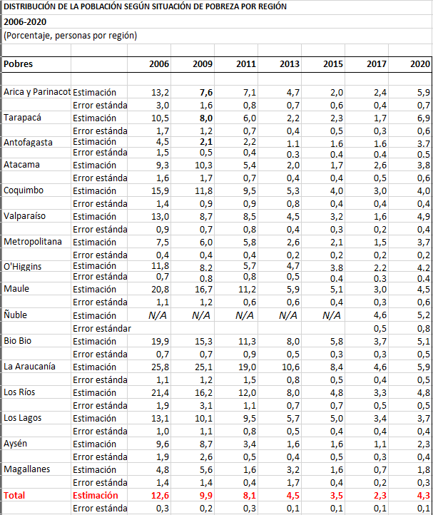
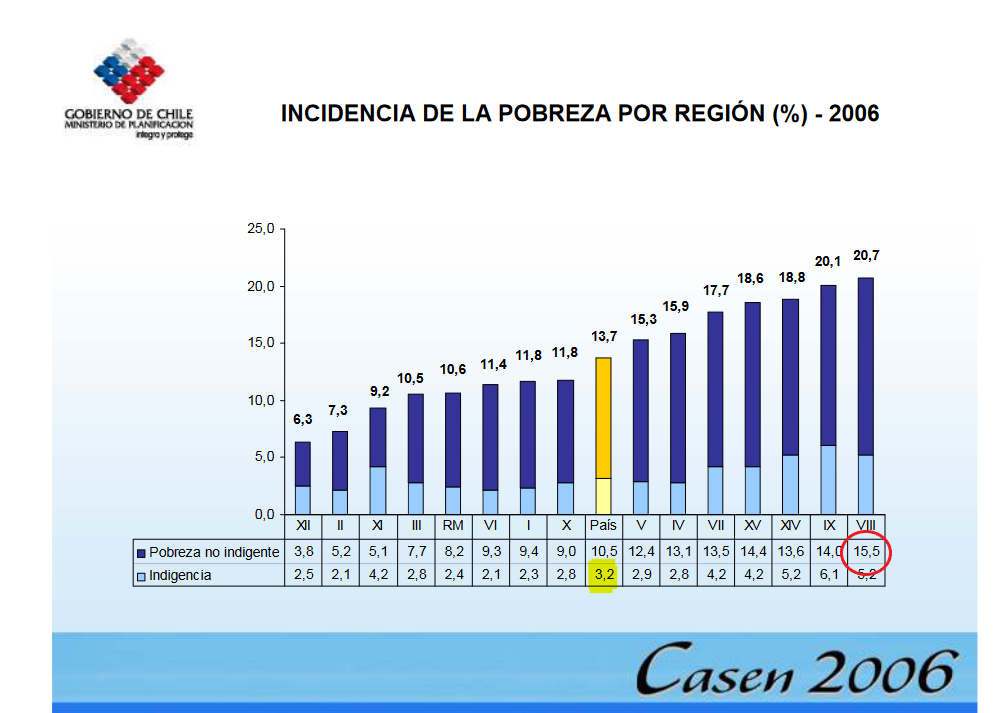
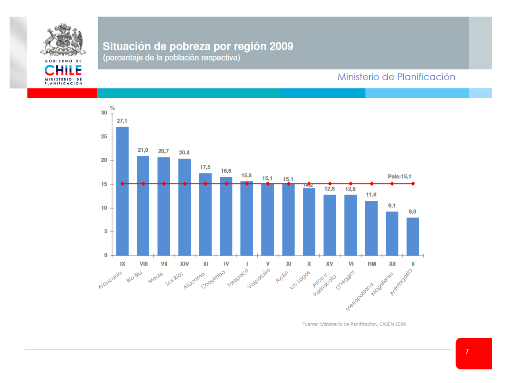
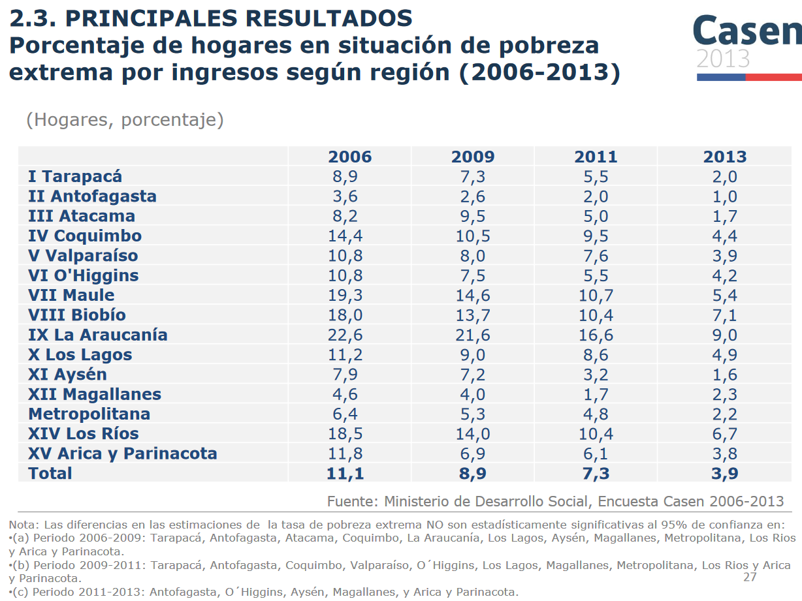
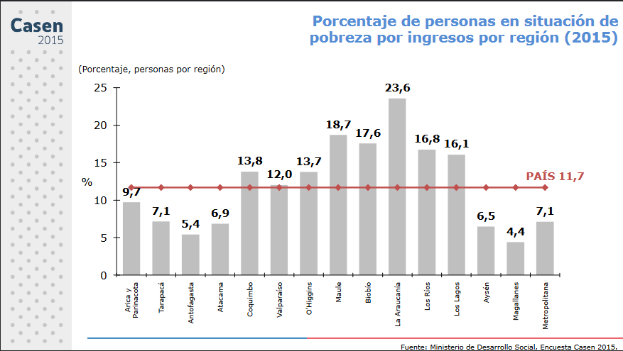

```{r , message=FALSE, warning=FALSE, include = FALSE, eecho = FALSE}
#suppressWarnings(library(RODBC))
library(ggplot2)
library(ggpubr)
library(markdown)
library(shiny)
library(shinythemes)
library(tidyverse)
library(magrittr)
library(lubridate)
library(plotly)
library(xts)
library(dygraphs)
library(kableExtra)
library(knitr)
library("readxl")
library(rsconnect)
library(dplyr)
library(summarytools)
library(epiDisplay)
library(leaflet)
library(haven)
library(epiDisplay)
library("readxl")
library(expss)
library(hrbrthemes)
library(viridis)
library(viridisLite)
library(DescTools)
library(roperators)
library(shinycssloaders)
library(writexl)
library(labelled)
library(tidyverse)
library(haven)
library(readr)
library(sjmisc)
library(WriteXLS)
library(ineq)
library(readstata13)
library(reldist)
library(foreign)
library(DT)
```

# Introducción

En éste trabajo nos concentraremos en la distribución de la pobreza en Chile, pobreza que se divide en tres grandes grupos: no pobres, pobres y pobres extremos.

Veremos que para cifras del año y a nivel regional, los cálculos a los que llegamos son exactos a los obtenidos y publicados por Casen en cada año en que fue aplicada. Pero hay un problema: las cifras entregadas en los gobiernos de Bachelet y Piñera (2006,2009,2011) fueron corregidos según una nueva metodología que no conocemos. 

Como los valores que obtenemos a nivel regional son exactos a los publicados a nivel regional, podemos deducir que también lo serán a nivel comunal, por lo que ideamos una metodología para llevar las frecuencias de pobres y no pobres a niveles calculados con la nueva metodología para poder hacer comparaciones anuales entre Casen de diferentes años.

Los análisis oficiales que entrega Casen y que son descargables de [aquí](http://observatorio.ministeriodesarrollosocial.gob.cl/encuesta-casen-en-pandemia-2020) para el 2020 y de [aquí](http://observatorio.ministeriodesarrollosocial.gob.cl/encuesta-casen-2011) del 2011 hasta 1990, entregan estadísticas muy útiles sobres las cuales comparar.

# Leemos las bases de datos con nuestras variables basicas homologadas y las hacemos caracteres:

```{r}
casen_2006 <- readRDS("C:/Users/chris/Desktop/algoritmos generadores de ttcc v 3.0/casens_homologadas/casen_2006_homologado.rds")
casen_2006 <- mutate_if(casen_2006, is.factor, as.character)

casen_2009 <- readRDS("C:/Users/chris/Desktop/algoritmos generadores de ttcc v 3.0/casens_homologadas/casen_2009_homologado.rds")
casen_2009 <- mutate_if(casen_2009, is.factor, as.character)

casen_2011 <- readRDS("C:/Users/chris/Desktop/algoritmos generadores de ttcc v 3.0/casens_homologadas/casen_2011_homologado.rds")
casen_2011 <- mutate_if(casen_2011, is.factor, as.character)

casen_2013 <- readRDS("C:/Users/chris/Desktop/algoritmos generadores de ttcc v 3.0/casens_homologadas/casen_2013_homologado.rds")
casen_2013 <- mutate_if(casen_2013, is.factor, as.character)

casen_2015 <- readRDS("C:/Users/chris/Desktop/algoritmos generadores de ttcc v 3.0/casens_homologadas/casen_2015_homologado.rds")
casen_2015 <- mutate_if(casen_2015, is.factor, as.character)

casen_2017 <- readRDS("C:/Users/chris/Desktop/algoritmos generadores de ttcc v 3.0/casens_homologadas/casen_2017_homologado.rds")
casen_2017 <- mutate_if(casen_2017, is.factor, as.character)

casen_2020 <- readRDS("C:/Users/chris/Desktop/algoritmos generadores de ttcc v 3.0/casens_homologadas/casen_2020_homologado.rds")
casen_2020 <- mutate_if(casen_2020, is.factor, as.character)
```

### Agregamos los códigos comunales

```{r, warning=FALSE}
cod_com <- readRDS("C:/Users/chris/Desktop/archivos grandes/codigos_comunales_2006-2020.rds") 
names(cod_com)[2] <- "comuna"
#ttcc_migra_con_codigo_final <- merge(x=union_migra, y=cod_com, by="comuna")
```

<br>

# Pobreza por ingresos

Desde 1990 Casen publica información sobre el porcentaje de pobreza de los chilenos, divididos en tres categoriías: no pobres, pobres y pobres extremos. A continuación se muestran 3 informes diferentes de pobreza y pobreza extrema (los dos primeros se confirman):

## Pobreza 1


[(ver informe completo acá)](http://observatorio.ministeriodesarrollosocial.gob.cl/storage/docs/casen/2020/Resumen_de_resultados_de_Pobreza_por_Ingresos_y_Distribucion_de_Ingresos.pdf) 

Que coincide con otro informe:

## Pobreza 2



[(ver informe completo acá)](http://observatorio.ministeriodesarrollosocial.gob.cl/encuesta-casen-en-pandemia-2020)

## Pobreza 3



1. Por un lado podemos apreciar dos informes con resultados distintos.

2.Nuestros calculos son casi iguales a nivel regional con el segundo informe.

[(ver informe completo acá)](http://observatorio.ministeriodesarrollosocial.gob.cl/storage/docs/casen/2006/Resultados_Pobreza_Casen_2006.pdf) 

Entonces existen dos publicaciones oficiales de resultados de la medicion de la pobreza de la Casen: los del año y los actualizados.

Podemos demostrar que nuestros cálculos coinciden con los entregados del año 2006:

A continuación vamos a construir y verificar que nuestros cálculos coincidan con los oficiales no corregidos.

Cuando hablemos de pobrexa, siempre serán pobre no extrema y extrema.

## Pobreza por región y comuna al 2006

Obtenemos la frecuencia de población pobre por región al 2006:

```{r}
tabla_matp <-xtabs(casen_2006$EXPR~R+CORTE, data = casen_2006)
tabla_matp
```

% de población pobre por región al 2006:

```{r}
indigente <- tabla_matp[,1]
no_pobre<- tabla_matp[,2]
pobre_no_ind <- tabla_matp[,3]
total <- tabla_matp[,1] + tabla_matp[,2] + tabla_matp[,3]
pobres <- (indigente+pobre_no_ind)*100/total
pobres <- as.data.frame(pobres)
pobres
```

Obtenemos la frecuencia de población pobre por comuna al 2006:

```{r}
tabla_matp <-xtabs(casen_2006$EXPC~COMUNA+CORTE, data = casen_2006)
head(tabla_matp)
```

% de población pobre por comuna al 2006:

```{r}
indigente <- tabla_matp[,1]
no_pobre<- tabla_matp[,2]
pobre_no_ind <- tabla_matp[,3]
total <- tabla_matp[,1] + tabla_matp[,2] + tabla_matp[,3]
pobres <- (indigente+pobre_no_ind)*100/total
pobres <- as.data.frame(pobres)
head(pobres)
```

***

# Verificaremos la exactitud de nuestros calculos para los años restantes 2009, 2011, 2013, 2015, 2017 y 2020.

## 2009



## Pobreza por region y comuna al 2009

Obtenemos la frecuencia de población pobre por región al 2009:

```{r}
tabla_matp <-xtabs(casen_2009$EXPR~REGION+CORTE, data = casen_2009)
tabla_matp
```

% de población pobre por región al 2009:

```{r}
indigente <- tabla_matp[,1]
no_pobre<- tabla_matp[,2]
pobre_no_ind <- tabla_matp[,3]
total <- tabla_matp[,1] + tabla_matp[,2] + tabla_matp[,3]
pobres <- (indigente+pobre_no_ind)*100/total
pobres <- as.data.frame(pobres)
pobres
```

Obtenemos la frecuencia de población pobre por comuna al 2009:

```{r}
tabla_matp <-xtabs(casen_2009$EXPC~COMUNA+CORTE, data = casen_2009)
head(tabla_matp)
```

% de población pobre por comuna al 2009:

```{r}
indigente <- tabla_matp[,1]
no_pobre<- tabla_matp[,2]
pobre_no_ind <- tabla_matp[,3]
total <- tabla_matp[,1] + tabla_matp[,2] + tabla_matp[,3]
pobres <- (indigente+pobre_no_ind)*100/total
pobres <- as.data.frame(pobres)
head(pobres)
```

***

## Pobreza por region y comuna al 2011

Obtenemos la frecuencia de población pobre por región al 2011:

```{r}
tabla_matp <-xtabs(casen_2011$expr_full~region+corte, data = casen_2011)
tabla_matp
```

% de población pobre por región al 2011:

```{r}
indigente <- tabla_matp[,3]
no_pobre<- tabla_matp[,1]
pobre_no_ind <- tabla_matp[,2]
total <- tabla_matp[,1] + tabla_matp[,2] + tabla_matp[,3]
pobres <- (indigente+pobre_no_ind)*100/total
pobres <- as.data.frame(pobres)
pobres
```

Obtenemos la frecuencia de población pobre por comuna al 2011:

```{r}
tabla_matp <-xtabs(casen_2011$expc_full~comuna+corte, data = casen_2011)
head(tabla_matp)
```

% de población pobre por comuna al 2011:

```{r}
indigente <- tabla_matp[,3]
no_pobre<- tabla_matp[,1]
pobre_no_ind <- tabla_matp[,2]
total <- tabla_matp[,1] + tabla_matp[,2] + tabla_matp[,3]
pobres <- (indigente+pobre_no_ind)*100/total
pobres <- as.data.frame(pobres)
head(pobres)
```

***
A partir del 2013 no hay que corregir

## 2013



Obtenemos la frecuencia de población pobre por región al 2013:

```{r}
tabla_matp <-xtabs(casen_2013$expr~region+casen_2013$pobreza_MN, data = casen_2013)
tabla_matp
```

% de población pobre por región al 2013:

```{r}
indigente <- tabla_matp[,2]
pobre_no_ind <- tabla_matp[,3]
no_pobre <- tabla_matp[,1]
total <- tabla_matp[,1] + tabla_matp[,2] + tabla_matp[,3]
pobres <- (indigente + pobre_no_ind)*100/total
pobres <- data.frame(pobres)
pobres
```

Obtenemos la frecuencia de población pobre por comuna al 2013:

```{r}
tabla_matp <-xtabs(casen_2013$expc~comuna+pobreza_MN, data = casen_2013)
head(tabla_matp)
```

% de población pobre por comuna al 2013:

```{r}
indigente <- tabla_matp[,2]
no_pobre<- tabla_matp[,1]
pobre_no_ind <- tabla_matp[,3]
total <- tabla_matp[,1] + tabla_matp[,2] + tabla_matp[,3]
pobres <- (indigente+pobre_no_ind)*100/total
pobres <- as.data.frame(pobres)
head(pobres)
```

***

## 2015



Obtenemos la frecuencia de población pobre por región al 2015:

```{r}
tabla_matp <-xtabs(casen_2015$expr~region+casen_2015$pobreza, data = casen_2015)
tabla_matp
```

% de población pobre por región al 2015:

```{r}
indigente <- tabla_matp[,2]
pobre_no_ind <- tabla_matp[,3]
no_pobre <- tabla_matp[,1]
total <- tabla_matp[,1] + tabla_matp[,2] + tabla_matp[,3]
pobres <- (indigente+pobre_no_ind)*100/total
pobres <- data.frame(pobres)
pobres
```

Obtenemos la frecuencia de población pobre por comuna al 2015:

```{r}
tabla_matp <-xtabs(casen_2015$expc_todas~comuna+pobreza, data = casen_2015)
head(tabla_matp)
```

% de población pobre por comuna al 2015:

```{r}
indigente <- tabla_matp[,2]
no_pobre<- tabla_matp[,1]
pobre_no_ind <- tabla_matp[,3]
total <- tabla_matp[,1] + tabla_matp[,2] + tabla_matp[,3]
pobres <- (indigente+pobre_no_ind)*100/total
pobres <- as.data.frame(pobres)
head(pobres)
```

***

## 2017

Obtenemos la frecuencia de población pobre por región al 2017:

```{r}
tabla_matp <-xtabs(casen_2017$expr~region+casen_2017$pobreza, data = casen_2017)
tabla_matp
```

% de población pobre por región al 2017:

```{r}
indigente <- tabla_matp[,2]
pobre_no_ind <- tabla_matp[,3]
no_pobre <- tabla_matp[,1]
total <- tabla_matp[,1] + tabla_matp[,2] + tabla_matp[,3]
pobres <- (indigente+pobre_no_ind)*100/total
pobres <- data.frame(pobres)
pobres
```

Obtenemos la frecuencia de población pobre por comuna al 2017:

```{r}
tabla_matp <-xtabs(casen_2017$expc~comuna+pobreza, data = casen_2017)
head(tabla_matp)
```

% de población pobre por comuna al 2017:

```{r}
indigente <- tabla_matp[,2]
no_pobre<- tabla_matp[,1]
pobre_no_ind <- tabla_matp[,3]
total <- tabla_matp[,1] + tabla_matp[,2] + tabla_matp[,3]
pobres <- (indigente+pobre_no_ind)*100/total
pobres <- as.data.frame(pobres)
head(pobres)
```

***

## 2020

Obtenemos la frecuencia de población pobre por región al 2020:

```{r}
tabla_matp <-xtabs(casen_2020$expr~region+pobreza, data = casen_2020)
tabla_matp
```

% de población pobre por región al 2020:

```{r}
indigente <- tabla_matp[,2]
pobre_no_ind <- tabla_matp[,3]
no_pobre <- tabla_matp[,1]
total <- tabla_matp[,1] + tabla_matp[,2] + tabla_matp[,3]
pobres <- (indigente+pobre_no_ind)*100/total
pobres <- data.frame(pobres)
pobres
```

Obtenemos la frecuencia de población pobre por comuna al 2020:

```{r}
tabla_matp <-xtabs(casen_2020$expc~comuna+pobreza, data = casen_2020)
head(tabla_matp)
```

% de población pobre por comuna al 2020:

```{r}
indigente <- tabla_matp[,2]
no_pobre<- tabla_matp[,1]
pobre_no_ind <- tabla_matp[,3]
total <- tabla_matp[,1] + tabla_matp[,2] + tabla_matp[,3]
pobres <- (indigente+pobre_no_ind)*100/total
pobres <- as.data.frame(pobres)
head(pobres)
```

<br>

```{r}

# datatable(tabla_matp, extensions = 'Buttons', escape = FALSE, rownames = FALSE,
#           options = list(dom = 'Bfrtip',
#           buttons = list('colvis', list(extend = 'collection',
#           buttons = list(
#           list(extend='copy'),
#           list(extend='excel',
#             filename = 'hitStats'),
#           list(extend='pdf',
#             filename= 'hitStats')),
#           text = 'Download')), scrollX = TRUE))

# Desgargue información de pobreza del 2015, 2017 y 2020:

# pobreza_15_20 <- rbind(tabla_matp15,tabla_matp17,tabla_matp20)
# datatable(pobreza_15_20, extensions = 'Buttons', escape = FALSE, rownames = FALSE,
#           options = list(dom = 'Bfrtip',
#           buttons = list('colvis', list(extend = 'collection',
#           buttons = list(
#           list(extend='copy'),
#           list(extend='excel',
#             filename = 'hitStats'),
#           list(extend='pdf',
#             filename= 'hitStats')),
#           text = 'Download')), scrollX = TRUE))

# Bibliografia:

# https://ciperchile.cl/wp-content/uploads/INDICE-DE-PRIORIDAD-SOCIAL-2014.pdf -->
# Ingreso autónomo promedio e ingreso monetario promedio del hogar a nivel regional el 2015:
# https://www.bcn.cl/portal/noticias?id=principales-resultados-sobre-pobreza-e-ingresos-regionales-encuesta-casen-2015 
# https://datasocial.ministeriodesarrollosocial.gob.cl/dataSocial/csv/Tablas_Ingreso.xlsx)  -->
# https://datasocial.ministeriodesarrollosocial.gob.cl/fichaIndicador/513/2) 
```

<br>
<br>
<br>
<br>
<br>
<br>
<br>


