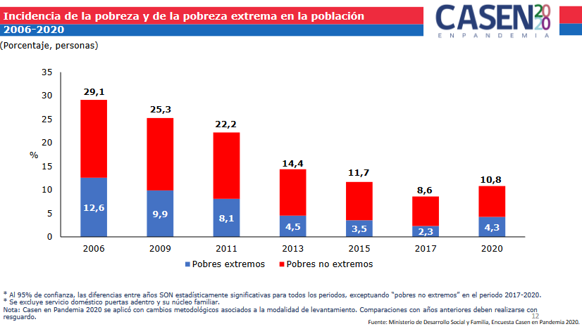

date: `r format(Sys.time(), "%d-%m-%Y")`
<style type="text/css">
.main-container {
  max-width: 1600px;
  margin-left: 100px;
  margin-right: auto;
}
</style>
 
```{r , message=FALSE, warning=FALSE, include = FALSE, echo = FALSE}

#suppressWarnings(library(RODBC))

library(ggplot2)
library(ggpubr)
library(markdown)
library(shiny)
library(shinythemes) 
library(magrittr)
library(lubridate)
library(plotly)
library(xts)
library(dygraphs)
library(kableExtra)
library(knitr)
library("readxl")
library(rsconnect)
library(dplyr)
library(summarytools)
library(epiDisplay)  
library(expss)
library(hrbrthemes)
library(viridis)
library(viridisLite)
library(DescTools)
library(roperators)
library(shinycssloaders)
library(writexl)
library(labelled)
library(tidyverse)
library(haven)
library(readr)
library(sjmisc)
library(WriteXLS)
library(ineq)
library(readstata13)
library(reldist) 
library(DT)
library(zoo)

```

# Introducción

Las cifras oficiales de pobreza actualizadas medidas por las últimas 7 Casen se pueden ver en el siguiente diagrama:



Existiendo un descuadre en los primeros tres años de su aplicación con las cifras de la Casen tal como fue aplicada en esos años. Ésto, debido a que fué implementada una "Nueva metodología para el cálculo de la pobreza" que pasamos ahora a explicar y a aplicar por nuestra cuenta, con el objetivo de averiguar de qué cambios se trataban y si coinciden los cálculos oficiales con los calculados por cuenta propia.

# Datos Casen

Los datos de la encuesta Casen son que utilizamos son los originales. Sólo que hemos integrado factores de expansión ausentes en un año en el que faltaban para muchas comunas y que tuvimos que pedir por transparencia pública y en otro año en vez de ceros existían valores NA lo que distorsionaban nuestros cálculos.

Lectura de nuestras bases de datos Casen periodo 2006-2020:

```{r, message=FALSE, warning=FALSE}
direccion <- "C:/Users/chris/Desktop/archivos grandes/"

dataset_06 <<- readRDS(paste0(direccion,"casen_2006_c.rds"))
dataset_06 <- mutate_if(dataset_06, is.factor, as.character) 
dataset_09 <<- readRDS(paste0(direccion,"casen_2009_c.rds"))
dataset_09 <- mutate_if(dataset_09, is.factor, as.character)
dataset_11 <<- readRDS(paste0(direccion,"casen_2011_c.rds"))
dataset_11 <- mutate_if(dataset_11, is.factor, as.character) 
dataset_13 <<- readRDS(paste0(direccion,"casen_2013_c.rds"))
dataset_13 <- mutate_if(dataset_13, is.factor, as.character) 
dataset_15 <<- readRDS(paste0(direccion,"casen_2015_c.rds"))
dataset_15 <- mutate_if(dataset_15, is.factor, as.character)
dataset_17 <<- readRDS(paste0(direccion,"casen_2017_c.rds"))
dataset_17 <- mutate_if(dataset_17, is.factor, as.character)
dataset_20 <<- readRDS(paste0(direccion,"casen_2020_c.rds"))
dataset_20 <- mutate_if(dataset_20, is.factor, as.character)
```

###########################################################################
###########################################################################
###########################################################################

# 2006

## Casen 2006 nueva metodología

Desde http://observatorio.ministeriodesarrollosocial.gob.cl/encuesta-casen-2006 leemos la Casen con la nueva metodología (en adelante nm) de 2006 llamada "Base de datos Complementaria de Ingresos Nueva Metodología Casen 2006 SPSS" y la comparemos con la Casen original aplicada ese año:

Base de datos Complementaria de Ingresos Nueva Metodología Casen 2006:

```{r, message=FALSE, warning=FALSE}
dataset_06_nm <- read.spss("C:/Users/chris/Desktop/archivos grandes/Ingresos MN 2006.sav", to.data.frame = TRUE)
head(dataset_06_nm,5)
```

Podemos ver que la "Base de datos Complementaria de Ingresos Nueva Metodología Casen 2006" es un subset de la Casen original que da cuenta sólo de los ingresos de los encuestados, su pertenencia a los deciles por ingresos y su clasificación dentro de las categorías de pobreza (pobreza_MN).

Extraigamos sólo las columnas que nos son relevantes pra nuestros propósitos actuales:

```{r, message=FALSE, warning=FALSE}
dataset_06_nm_relevante <- dataset_06_nm[,c(1,2,3,4)]
head(dataset_06_nm_relevante,5)
```

Nos encontramos con la ausencia de una clave que nos permita unir ésta data con la Casen tradicional y así obtener entre otras cosas el factor de expansión.

```{r}
unique(dataset_06_nm_relevante$pobreza_MN)
```

Cuantos NA existen en la columna pobreza_MN?

```{r}
sum(is.na(dataset_06_nm_relevante$pobreza_MN))
```

Creación de una clave y limpieza de campos irrelevantes

Para ello, unimos las columnas seg, f y o para crear la clave y luego nos deshacemos de ellas.

seg Segmento (sección).\
f   Identificación del hogar y\
o   Número de orden de la persona dentro del hogar

```{r}
# Construimos la clave:
dataset_06_nm_relevante$clave <- paste0(dataset_06_nm_relevante$seg,  dataset_06_nm_relevante$f,  dataset_06_nm_relevante$o, sep = "")
# Nos deshacemos de las que la construyen:
dataset_06_nm_relevante <- dataset_06_nm_relevante[,-c(1:3)]
dataset_06_nm_relevante_limpia <- dataset_06_nm_relevante
dataset_06_nm_relevante_limpia
```

# Casen 2006 vieja metodología

Leamos la Casen 2006 aplicada ese año rescatando sólo las columnas que nos importan:

```{r}
dataset_06
dataset_06_relevante <- dataset_06[,c(1:4,11,342)]
dataset_06_relevante
```

Cuantos NA existen en la columna CORTE?

```{r}
sum(is.na(dataset_06_relevante$CORTE))
```  


Realizamos el mismo procedimiento anterior de construcción de claves y eliminación de columna sin utilidad:

```{r}
# Construímos una clave
dataset_06_relevante$clave <- paste0(dataset_06_relevante$SEG,  dataset_06_relevante$F,  dataset_06_relevante$O, sep = "")
# nos deshacemos de las columnas que ya no prestan utilidad:
dataset_06_relevante_limpia <- dataset_06_relevante[,-c(2:4)]
dataset_06_relevante_limpia
```

# Las unimos

```{r}
dataset_2006 <- merge(dataset_06_relevante_limpia,dataset_06_nm_relevante_limpia,by="clave")
dataset_pobreza_2006 <- dataset_2006
dataset_pobreza_2006
```

# Prueba

Haremos una prueba corroborando con las cifras oficiales.

Población total de Chile al 2006:

```{r}
11424554+2663366+2027451
```

Pobres extremos

```{r}
2027451*100/16115371
```

Pobres

```{r}
2663366*100/16115371
```

Pobres extremos + Pobres

```{r}
12.58085+16.52687
```


# Cálculo del porcentaje de pobreza

Aplicamos una tabla de contingencia:

```{r}
tabla_matp <-xtabs(dataset_pobreza_2006$EXPC~COMUNA+pobreza_MN, data = dataset_pobreza_2006)
tabla_matp <- as.data.frame(tabla_matp)
aaa <- split(tabla_matp, factor(sort(rank(row.names(tabla_matp))%%3)))
```


```{r}
pobreza_extrema_en_el_2006 <- as.data.frame(aaa[1])
pobreza_no_extrema_en_el_2006 <- as.data.frame(aaa[2])
no_pobreza_en_el_2006 <- as.data.frame(aaa[3])

pobreza_por_comuna_2006 <- cbind(pobreza_extrema_en_el_2006,pobreza_no_extrema_en_el_2006,no_pobreza_en_el_2006)
```


```{r}
pobreza_por_comuna_2006 <- pobreza_por_comuna_2006[,-c(2,4,5,7,8)]
pobreza_por_comuna_2006
```


```{r}
names(pobreza_por_comuna_2006)[1] <- 'Comuna'
names(pobreza_por_comuna_2006)[2] <- 'Pobres extremos'
names(pobreza_por_comuna_2006)[3] <- 'Pobres no extremos'
names(pobreza_por_comuna_2006)[4] <- 'No pobres'

pobreza_por_comuna_2006$porcentaje_de_pobreza <- ((pobreza_por_comuna_2006[,2]+pobreza_por_comuna_2006[,3])*100)/(pobreza_por_comuna_2006[,2]+pobreza_por_comuna_2006[,3]+pobreza_por_comuna_2006[,4])
pobreza_por_comuna_2006$año <- "2006"
pobreza_por_comuna_2006
```

```{r}
writexl::write_xlsx(pobreza_por_comuna_2006,"pobreza_por_comuna_2006.xlsx")
saveRDS(pobreza_por_comuna_2006, "pobreza_por_comuna_2006.rds")
```


########################################################################################
########################################################################################
########################################################################################


# 2009

## Casen 2009 nueva metodología

Desde http://observatorio.ministeriodesarrollosocial.gob.cl/encuesta-casen-2009 leemos la Casen con la nueva metodología (en adelante nm) de 2009 llamada "Base de datos Complementaria de Ingresos Nueva Metodología Casen 2009 SPSS" y la comparemos con la Casen original aplicada ese año:

Base de datos Complementaria de Ingresos Nueva Metodología Casen 2009:

```{r, message=FALSE, warning=FALSE}
dataset_09_nm <- read.spss("C:/Users/chris/Desktop/archivos grandes/Ingresos MN 2009.sav", to.data.frame = TRUE)
head(dataset_09_nm,5)
```

Podemos ver que la "Base de datos Complementaria de Ingresos Nueva Metodología Casen 2009" es un subset de la Casen original que da cuenta sólo de los ingresos de los encuestados, su pertenencia a los deciles por ingresos y su clasificación dentro de las categorías de pobreza (pobreza_MN).

Extraigamos sólo las columnas que nos son relevantes pra nuestros propósitos actuales:

```{r, message=FALSE, warning=FALSE}
dataset_09_nm_relevante <- dataset_09_nm[,c(1,2,3,4,5)]
head(dataset_09_nm_relevante,5)
```

Nos encontramos con la ausencia de una clave que nos permita unir ésta data con la Casen tradicional y así obtener entre otras cosas el factor de expansión.

```{r}
unique(dataset_09_nm_relevante$pobreza_MN)
```

Cuantos NA existen en la columna pobreza_MN?

```{r}
sum(is.na(dataset_09_nm_relevante$pobreza_MN))
```

Creación de una clave y limpieza de campos irrelevantes

Para ello, unimos las columnas seg, f y o para crear la clave y luego nos deshacemos de ellas.

SEGMENTO        Segmento
IDVIV
HOGAR           Identificación del hogar
O               Número de orden de la persona dentro del hogar      

```{r}
# Construimos la clave:
dataset_09_nm_relevante$clave <- paste0(dataset_09_nm_relevante$SEGMENTO,  dataset_09_nm_relevante$IDVIV,  dataset_09_nm_relevante$HOGAR, dataset_09_nm_relevante$O, sep = "")
dataset_09_nm_relevante
```


```{r}
# Construimos la clave:
dataset_09_nm_relevante$clave <- paste0(dataset_09_nm_relevante$SEGMENTO,  dataset_09_nm_relevante$IDVIV,  dataset_09_nm_relevante$HOGAR, dataset_09_nm_relevante$O, sep = "")
dataset_09_nm_relevante
```


```{r}
# Nos deshacemos de las que la construyen:
dataset_09_nm_relevante_limpia <- dataset_09_nm_relevante[,-c(1:4)]
dataset_09_nm_relevante_limpia
```

# Casen 2009 vieja metodología

Leamos la Casen 2009 aplicada ese año rescatando sólo las columnas que nos importan:

```{r}
# dataset_09
dataset_09_relevante <- dataset_09[,c(1:5,16,303)]
dataset_09_relevante
```

Cuantos NA existen en la columna CORTE?

```{r}
sum(is.na(dataset_09_relevante$CORTE))
```  


Realizamos el mismo procedimiento anterior de construcción de claves y eliminación de columna sin utilidad:

```{r}
# Construímos una clave
dataset_09_relevante$clave <- paste0(dataset_09_relevante$SEGMENTO,  dataset_09_relevante$IDVIV,  dataset_09_relevante$HOGAR, dataset_09_relevante$O, sep = "")
dataset_09_relevante
```


```{r}
# nos deshacemos de las columnas que ya no prestan utilidad:
dataset_09_relevante_limpia <- dataset_09_relevante[,-c(2:5)]
dataset_09_relevante_limpia
```

# Las unimos

```{r}
dataset_2009 <- merge(dataset_09_relevante_limpia,dataset_09_nm_relevante_limpia,by="clave")
dataset_pobreza_2009 <- dataset_2009
dataset_pobreza_2009
```

Aplicamos una tabla de contingencia:

```{r}
tabla_matp <-xtabs(dataset_pobreza_2009$EXPC~pobreza_MN, data = dataset_pobreza_2009)
tabla_matp
```

Población total de Chile al 2009:

```{r}
1630581+2555810 +12398130
```

Pobres extremos

```{r}
1630581*100/16584521
```

Pobres

```{r}
2555810*100/16584521
```

Pobres extremos + Pobres

```{r}
9.831945+15.41082
```

# Cálculo del porcentaje de pobreza

Aplicamos una tabla de contingencia:

```{r}
tabla_matp <-xtabs(dataset_pobreza_2009$EXPC~COMUNA+pobreza_MN, data = dataset_pobreza_2009)
tabla_matp <- as.data.frame(tabla_matp)
aaa <- split(tabla_matp, factor(sort(rank(row.names(tabla_matp))%%3)))

pobreza_extrema_en_el_2009 <- as.data.frame(aaa[1])
pobreza_no_extrema_en_el_2009 <- as.data.frame(aaa[2])
no_pobreza_en_el_2009 <- as.data.frame(aaa[3])

pobreza_por_comuna_2009 <- cbind(pobreza_extrema_en_el_2009,pobreza_no_extrema_en_el_2009,no_pobreza_en_el_2009)
pobreza_por_comuna_2009 <- pobreza_por_comuna_2009[,-c(2,4,5,7,8)]
names(pobreza_por_comuna_2009)[1] <- 'Comuna'
names(pobreza_por_comuna_2009)[2] <- 'Pobres extremos'
names(pobreza_por_comuna_2009)[3] <- 'Pobres no extremos'
names(pobreza_por_comuna_2009)[4] <- 'No pobres'
```


```{r}
pobreza_por_comuna_2009$porcentaje_de_pobreza <- ((pobreza_por_comuna_2009[,2]+pobreza_por_comuna_2009[,3])*100)/(pobreza_por_comuna_2009[,2]+pobreza_por_comuna_2009[,3]+pobreza_por_comuna_2009[,4])
pobreza_por_comuna_2009$año <- "2009"
pobreza_por_comuna_2009
```
```{r}
writexl::write_xlsx(pobreza_por_comuna_2009,"pobreza_por_comuna_2009.xlsx")
saveRDS(pobreza_por_comuna_2009, "pobreza_por_comuna_2009.rds")
```

########################################################################################
########################################################################################
########################################################################################


## 2011 

folio
o

## Casen 2011 nueva metodología

Desde http://observatorio.ministeriodesarrollosocial.gob.cl/encuesta-casen-2011 leemos la Casen con la nueva metodología (en adelante nm) de 2011 llamada "Base de datos Complementaria de Ingresos Nueva Metodología Casen 2011 SPSS" y la comparemos con la Casen original aplicada ese año:

Base de datos Complementaria de Ingresos Nueva Metodología Casen 2011:

```{r, message=FALSE, warning=FALSE}
dataset_11_nm <- read.spss("C:/Users/chris/Desktop/archivos grandes/Ingresos MN 2011.sav", to.data.frame = TRUE)
head(dataset_11_nm,5)
```

Podemos ver que la "Base de datos Complementaria de Ingresos Nueva Metodología Casen 2011" es un subset de la Casen original que da cuenta sólo de los ingresos de los encuestados, su pertenencia a los deciles por ingresos y su clasificación dentro de las categorías de pobreza (pobreza_MN).

Extraigamos sólo las columnas que nos son relevantes pra nuestros propósitos actuales:

```{r, message=FALSE, warning=FALSE}
dataset_11_nm_relevante <- dataset_11_nm[,c(1,2,3)]
head(dataset_11_nm_relevante,5)
```

Nos encontramos con la ausencia de una clave que nos permita unir ésta data con la Casen tradicional y así obtener entre otras cosas el factor de expansión.

```{r}
unique(dataset_11_nm_relevante$pobreza_MN)
```

Cuantos NA existen en la columna pobreza_MN?

```{r}
sum(is.na(dataset_11_nm_relevante$pobreza_MN))
```

Creación de una clave y limpieza de campos irrelevantes

Para ello, unimos las columnas folio y o para crear la clave y luego nos deshacemos de ellas.

folio
o           Número de orden de la persona dentro del hogar      

```{r}
# Construimos la clave:
dataset_11_nm_relevante$clave <- paste0(dataset_11_nm_relevante$folio,  dataset_11_nm_relevante$o, sep = "")
dataset_11_nm_relevante
```

```{r}
# Nos deshacemos de las que la construyen:
dataset_11_nm_relevante_limpia <- dataset_11_nm_relevante[,-c(1:2)]
dataset_11_nm_relevante_limpia
```

# Casen 2011 vieja metodología

Leamos la Casen 2011 aplicada ese año rescatando sólo las columnas que nos importan:

```{r}
# dataset_11
dataset_11_relevante <- dataset_11[,c(1,3,4,11,321)]
dataset_11_relevante
```

Cuantos NA existen en la columna corte?

```{r}
sum(is.na(dataset_11_relevante$corte))
```  


Realizamos el mismo procedimiento anterior de construcción de claves y eliminación de campos sin utilidad:

```{r}
# Construímos una clave
dataset_11_relevante$clave <- paste0(dataset_11_relevante$folio,  dataset_11_relevante$o, sep = "")
dataset_11_relevante
```


```{r}
# nos deshacemos de las columnas que ya no prestan utilidad:
dataset_11_relevante_limpia <- dataset_11_relevante[,-c(2:3)]
dataset_11_relevante_limpia
```

# Las unimos

```{r}
dataset_2011 <- merge(dataset_11_relevante_limpia,dataset_11_nm_relevante_limpia,by="clave")
dataset_pobreza_2011 <- dataset_2011
dataset_pobreza_2011
```

Aplicamos una tabla de contingencia:

```{r}
tabla_matp <-xtabs(dataset_pobreza_2011$expc_full~pobreza_MN, data = dataset_pobreza_2011)
tabla_matp
```

Población total de Chile al 2011:

```{r}
  910164        +    1598941       +     8713093 
```

Pobres extremos

```{r}
910164*100/11222198
```

Pobres

```{r}
1598941*100/11222198
```

Pobres extremos + Pobres

```{r}
8.11039+14.24802
```


# Cálculo del porcentaje de pobreza

Aplicamos una tabla de contingencia:

```{r}
tabla_matp <-xtabs(dataset_pobreza_2011$expc_full~comuna+pobreza_MN, data = dataset_pobreza_2011)
tabla_matp <- as.data.frame(tabla_matp)
aaa <- split(tabla_matp, factor(sort(rank(row.names(tabla_matp))%%3)))

pobreza_extrema_en_el_2011 <- as.data.frame(aaa[1])
pobreza_no_extrema_en_el_2011 <- as.data.frame(aaa[2])
no_pobreza_en_el_2011 <- as.data.frame(aaa[3])

pobreza_por_comuna_2011 <- cbind(pobreza_extrema_en_el_2011,pobreza_no_extrema_en_el_2011,no_pobreza_en_el_2011)
pobreza_por_comuna_2011 <- pobreza_por_comuna_2011[,-c(2,4,5,7,8)]
names(pobreza_por_comuna_2011)[1] <- 'Comuna'
names(pobreza_por_comuna_2011)[2] <- 'Pobres extremos'
names(pobreza_por_comuna_2011)[3] <- 'Pobres no extremos'
names(pobreza_por_comuna_2011)[4] <- 'No pobres'
```


```{r}
pobreza_por_comuna_2011$porcentaje_de_pobreza <- ((pobreza_por_comuna_2011[,2]+pobreza_por_comuna_2011[,3])*100)/(pobreza_por_comuna_2011[,2]+pobreza_por_comuna_2011[,3]+pobreza_por_comuna_2011[,4])
pobreza_por_comuna_2011$año <- "2011"
pobreza_por_comuna_2011
```

```{r}
writexl::write_xlsx(pobreza_por_comuna_2011,"pobreza_por_comuna_2011.xlsx")
saveRDS(pobreza_por_comuna_2011, "pobreza_por_comuna_2011.rds")
```


########################################################################################
########################################################################################
########################################################################################

2013 

<span style="color:red"> Se comienza a aplicar la nueva metodología </span>

Leamos la Casen 2013 aplicada ese año rescatando sólo las columnas que nos importan:

```{r}
# dataset_13
dataset_13_relevante <- dataset_13[,c(1,2,3,578,583)]
dataset_13_relevante
```

Cuantos NA existen en la columna pobreza_MN?

```{r}
sum(is.na(dataset_13_relevante$pobreza_MN))
```  

Aplicamos tablas de contingencia

```{r}
tabla_matp <-xtabs(dataset_13_relevante$expc~pobreza_MN, data = dataset_13_relevante)
tabla_matp
```

Población total de Chile al 2013:

```{r}
14745682+776164+1696553 
```

Pobres extremos

```{r}
776164 *100/17218399
```

Pobres

```{r}
1696553*100/17218399
```

Pobres extremos + Pobres

```{r}
4.507759+9.85314
```

################################################################################

# Cálculo del porcentaje de pobreza

Aplicamos una tabla de contingencia:

```{r}
tabla_matp <-xtabs(dataset_13_relevante$expc~comuna+pobreza_MN, data = dataset_13_relevante)
tabla_matp <- as.data.frame(tabla_matp)
aaa <- split(tabla_matp, factor(sort(rank(row.names(tabla_matp))%%3)))
```

```{r}
no_pobreza_en_el_2013 <- as.data.frame(aaa[1])
pobreza_extrema_en_el_2013 <- as.data.frame(aaa[2])
pobreza_no_extrema_en_el_2013 <- as.data.frame(aaa[3])

pobreza_por_comuna_2013 <- cbind(pobreza_extrema_en_el_2013,pobreza_no_extrema_en_el_2013,no_pobreza_en_el_2013)
pobreza_por_comuna_2013 <- pobreza_por_comuna_2013[,-c(2,4,5,7,8)]
names(pobreza_por_comuna_2013)[1] <- 'Comuna'
names(pobreza_por_comuna_2013)[2] <- 'Pobres extremos'
names(pobreza_por_comuna_2013)[3] <- 'Pobres no extremos'
names(pobreza_por_comuna_2013)[4] <- 'No pobres'
```

```{r}
pobreza_por_comuna_2013$porcentaje_de_pobreza <- ((pobreza_por_comuna_2013[,2]+pobreza_por_comuna_2013[,3])*100)/(pobreza_por_comuna_2013[,2]+pobreza_por_comuna_2013[,3]+pobreza_por_comuna_2013[,4])
pobreza_por_comuna_2013$año <- "2013"
pobreza_por_comuna_2013
```

```{r}
writexl::write_xlsx(pobreza_por_comuna_2013,"pobreza_por_comuna_2013.xlsx")
saveRDS(pobreza_por_comuna_2013, "pobreza_por_comuna_2013.rds")
```


########################################################################################
########################################################################################
########################################################################################

2015

<span style="color:red"> Se comienza a aplicar la nueva metodología </span>

Leamos la Casen 2015 aplicada ese año rescatando sólo las columnas que nos importan:

```{r}
# dataset_15
dataset_15_relevante <- dataset_15[,c(1,3,4,731,780)]
dataset_15_relevante
```

Cuantos NA existen en la columna pobreza?

```{r}
sum(is.na(dataset_15_relevante$pobreza))
```  

Aplicamos tablas de contingencia

```{r}
tabla_matp <-xtabs(dataset_15_relevante$expc_todas~pobreza, data = dataset_15_relevante)
tabla_matp
```

Población total de Chile al 2015:

```{r}
 15466212      +       616619        +    1407558 
```

Pobres extremos

```{r}
616619 *100/17490389
```

Pobres

```{r}
1407558*100/17490389
```

Pobres extremos + Pobres

```{r}
3.525473+8.047608
```

################################################################################

# Cálculo del porcentaje de pobreza

Aplicamos una tabla de contingencia:

```{r}
tabla_matp <-xtabs(dataset_15_relevante$expc_todas~comuna+pobreza, data = dataset_15_relevante)
tabla_matp <- as.data.frame(tabla_matp)
aaa <- split(tabla_matp, factor(sort(rank(row.names(tabla_matp))%%3)))
```

```{r}
no_pobreza_en_el_2015 <- as.data.frame(aaa[1])
pobreza_extrema_en_el_2015 <- as.data.frame(aaa[2])
pobreza_no_extrema_en_el_2015 <- as.data.frame(aaa[3])

pobreza_por_comuna_2015 <- cbind(pobreza_extrema_en_el_2015,pobreza_no_extrema_en_el_2015,no_pobreza_en_el_2015)
pobreza_por_comuna_2015 <- pobreza_por_comuna_2015[,-c(2,4,5,7,8)]
names(pobreza_por_comuna_2015)[1] <- 'Comuna'
names(pobreza_por_comuna_2015)[2] <- 'Pobres extremos'
names(pobreza_por_comuna_2015)[3] <- 'Pobres no extremos'
names(pobreza_por_comuna_2015)[4] <- 'No pobres'
```

```{r}
pobreza_por_comuna_2015$porcentaje_de_pobreza <- ((pobreza_por_comuna_2015[,2]+pobreza_por_comuna_2015[,3])*100)/(pobreza_por_comuna_2015[,2]+pobreza_por_comuna_2015[,3]+pobreza_por_comuna_2015[,4])
pobreza_por_comuna_2015$año <- "2015"
pobreza_por_comuna_2015
```

```{r}
writexl::write_xlsx(pobreza_por_comuna_2015,"pobreza_por_comuna_2015.xlsx")
saveRDS(pobreza_por_comuna_2015, "pobreza_por_comuna_2015.rds")
```


########################################################################################
########################################################################################
########################################################################################

2017

<span style="color:red"> Se comienza a aplicar la nueva metodología </span>

Leamos la Casen 2017 aplicada ese año rescatando sólo las columnas que nos importan:

```{r}
# dataset_17
dataset_17_relevante <- dataset_17[,c(1,2,3,10,767)]
dataset_17_relevante
```

Cuantos NA existen en la columna pobreza?

```{r}
sum(is.na(dataset_17_relevante$pobreza))
```  

Aplicamos tablas de contingencia

```{r}
tabla_matp <-xtabs(dataset_17_relevante$expc~pobreza, data = dataset_17_relevante)
tabla_matp
```

Población total de Chile al 2015:

```{r}
 16241747       +      407536      +      1099747 
```

Pobres extremos

```{r}
407536 *100/17749030
```

Pobres

```{r}
1099747 *100/17749030
```

Pobres extremos + Pobres

```{r}
2.296103 + 6.196096
```

################################################################################

# Cálculo del porcentaje de pobreza

Aplicamos una tabla de contingencia:

```{r}
tabla_matp <-xtabs(dataset_17_relevante$expc~comuna+pobreza, data = dataset_17_relevante)
tabla_matp <- as.data.frame(tabla_matp)
aaa <- split(tabla_matp, factor(sort(rank(row.names(tabla_matp))%%3)))
```

```{r}
no_pobreza_en_el_2017 <- as.data.frame(aaa[1])
pobreza_extrema_en_el_2017 <- as.data.frame(aaa[2])
pobreza_no_extrema_en_el_2017 <- as.data.frame(aaa[3])

pobreza_por_comuna_2017 <- cbind(pobreza_extrema_en_el_2017,pobreza_no_extrema_en_el_2017,no_pobreza_en_el_2017)
pobreza_por_comuna_2017 <- pobreza_por_comuna_2017[,-c(2,4,5,7,8)]
names(pobreza_por_comuna_2017)[1] <- 'Comuna'
names(pobreza_por_comuna_2017)[2] <- 'Pobres extremos'
names(pobreza_por_comuna_2017)[3] <- 'Pobres no extremos'
names(pobreza_por_comuna_2017)[4] <- 'No pobres'
```

```{r}
pobreza_por_comuna_2017$porcentaje_de_pobreza <- ((pobreza_por_comuna_2017[,2]+pobreza_por_comuna_2017[,3])*100)/(pobreza_por_comuna_2017[,2]+pobreza_por_comuna_2017[,3]+pobreza_por_comuna_2017[,4])
pobreza_por_comuna_2017$año <- "2017"
pobreza_por_comuna_2017
```

```{r}
writexl::write_xlsx(pobreza_por_comuna_2017,"pobreza_por_comuna_2017.xlsx")
saveRDS(pobreza_por_comuna_2017, "pobreza_por_comuna_2017.rds")
```


########################################################################################
########################################################################################
########################################################################################

2020

<span style="color:red"> Se comienza a aplicar la nueva metodología </span>

Leamos la Casen 2020 aplicada ese año rescatando sólo las columnas que nos importan:

```{r}
# dataset_20
dataset_20_relevante <- dataset_20[,c(7,1,2,17,588)]
dataset_20_relevante
```

Cuantos NA existen en la columna pobreza?

```{r}
sum(is.na(dataset_20_relevante$pobreza))
```  

Aplicamos tablas de contingencia

```{r}
tabla_matp <-xtabs(dataset_20_relevante$expc~pobreza, data = dataset_20_relevante)
tabla_matp
```

Población total de Chile al 2015:

```{r}
 17360850      +       848169      +      1278243 
```

Pobres extremos

```{r}
848169*100/19487262
```

Pobres

```{r}
1278243  *100/19487262
```

Pobres extremos + Pobres

```{r}
4.352428 + 6.559377
```

################################################################################

# Cálculo del porcentaje de pobreza

Aplicamos una tabla de contingencia:

```{r}
tabla_matp <-xtabs(dataset_20_relevante$expc~comuna+pobreza, data = dataset_20_relevante)
tabla_matp <- as.data.frame(tabla_matp)
aaa <- split(tabla_matp, factor(sort(rank(row.names(tabla_matp))%%3)))
```

```{r}
no_pobreza_en_el_2020 <- as.data.frame(aaa[1])
pobreza_extrema_en_el_2020 <- as.data.frame(aaa[2])
pobreza_no_extrema_en_el_2020 <- as.data.frame(aaa[3])

pobreza_por_comuna_2020 <- cbind(pobreza_extrema_en_el_2020,pobreza_no_extrema_en_el_2020,no_pobreza_en_el_2020)
pobreza_por_comuna_2020 <- pobreza_por_comuna_2020[,-c(2,4,5,7,8)]
names(pobreza_por_comuna_2020)[1] <- 'Comuna'
names(pobreza_por_comuna_2020)[2] <- 'Pobres extremos'
names(pobreza_por_comuna_2020)[3] <- 'Pobres no extremos'
names(pobreza_por_comuna_2020)[4] <- 'No pobres'
```

```{r}
pobreza_por_comuna_2020$porcentaje_de_pobreza <- ((pobreza_por_comuna_2020[,2]+pobreza_por_comuna_2020[,3])*100)/(pobreza_por_comuna_2020[,2]+pobreza_por_comuna_2020[,3]+pobreza_por_comuna_2020[,4])
pobreza_por_comuna_2020$año <- "2020"
pobreza_por_comuna_2020
```

```{r}
writexl::write_xlsx(pobreza_por_comuna_2020,"pobreza_por_comuna_2020.xlsx")
saveRDS(pobreza_por_comuna_2020, "pobreza_por_comuna_2020.rds")
```


 
# <span style="color:black">Aplicamos la interpolación </span>

```{r}
# tabla_pobreza <- tabla_madre[,c(1,2,3,5,8,11,14,17,20,23)]
# tabla_pobreza$p2007 <- NA
# tabla_pobreza$p2008 <- NA
# tabla_pobreza$p2010 <- NA
# tabla_pobreza$p2012 <- NA
# tabla_pobreza$p2014 <- NA
# tabla_pobreza$p2016 <- NA
# tabla_pobreza$p2018 <- NA
# tabla_pobreza$p2019 <- NA
# tabla_pobreza$p2021 <- NA
# tabla_pobreza <- tabla_pobreza[,c("Comuna","Código","Pobreza","porcentaje_pobreza1","p2007","p2008","porcentaje_pobreza2","p2010","porcentaje_pobreza3","p2012","porcentaje_pobreza4","p2014","porcentaje_pobreza5","p2016","porcentaje_pobreza6","p2018","p2019","porcentaje_pobreza7","p2021")]
# colnames(tabla_pobreza) <- c("Comuna","Código","Pobreza","p2006","p2007","p2008","p2009","p2010","p2011","p2012","p2013","p2014","p2015","p2016","p2017","p2018","p2019","p2020","p2021")
```
```{r}
# tabla_pobreza
```


```{r}
# receptaculo2 <- data.frame()
# for (n in 1:896) {
#   calculado <- na.approx(c(tabla_pobreza[n,c(4:19)])) #<<<------------  Codigo de interpolacion
#   # calculado <- as.data.frame(calculado)
#   receptaculo2 <- rbind(receptaculo2,calculado)
# }
# colnames(receptaculo2) <- c("p2006","p2007","p2008","p2009","p2010","p2011","p2012","p2013","p2014","p2015","p2016","p2017","p2018","p2019","p2020")
```


```{r}
# library(scales)
# tabla_final <- cbind(tabla_pobreza[,c(1,2,3)],receptaculo2)
# tabla_madre <- rbind(tb1,tb2,tb3)
# datatable(tabla_final, extensions = 'Buttons', escape = FALSE, rownames = FALSE,
#           options = list(dom = 'Bfrtip',
#           buttons = list('colvis', list(extend = 'collection',
#           buttons = list(
#           list(extend='copy'),
#           list(extend='excel',
#             filename = 'hitStats'),
#           list(extend='pdf',
#             filename= 'hitStats')),
#           
#           text = 'Download')), scrollX = TRUE))%>%
#     formatRound(c("p2006","p2007","p2008","p2009","p2010","p2011","p2012","p2013","p2014","p2015","p2016","p2017","p2018","p2019","p2020"), mark = "", digits = 2)%>%
#     formatPercentage(   c("p2006","p2007","p2008","p2009","p2010","p2011","p2012","p2013","p2014","p2015","p2016","p2017","p2018","p2019","p2020"))
```
 


