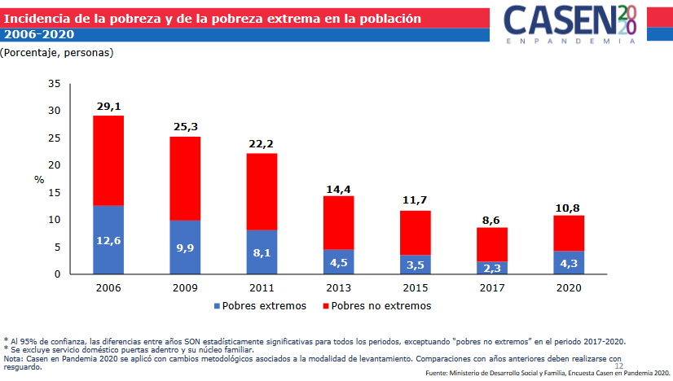

date: `r format(Sys.time(), "%d-%m-%Y")`
<style type="text/css">
.main-container {
  max-width: 1600px;
  margin-left: 100px;
  margin-right: auto;
}
</style>
 


```{r , message=FALSE, warning=FALSE, include = FALSE, eecho = FALSE}

#suppressWarnings(library(RODBC))

library(ggplot2)
library(ggpubr)
library(markdown)
library(shiny)
library(shinythemes) 
library(magrittr)
library(lubridate)
library(plotly)
library(xts)
library(dygraphs)
library(kableExtra)
library(knitr)
library("readxl")
library(rsconnect)
library(dplyr)
library(summarytools)
library(epiDisplay)  
library(expss)
library(hrbrthemes)
library(viridis)
library(viridisLite)
library(DescTools)
library(roperators)
library(shinycssloaders)
library(writexl)
library(labelled)
library(tidyverse)
library(haven)
library(readr)
library(sjmisc)
library(WriteXLS)

library(ineq)
library(readstata13)
library(reldist) 
library(DT)
library(zoo)

```

<h3>En un proceso laberíntico logramos obtener las bases de datos que contenian las categorías de pobreza que conincidian con las tablas oficiales de corrección retroactiva de la Casen</h3>

Lectura de bases de datos Casen

```{r, message=FALSE, warning=FALSE}

direccion <- switch(2,"C:/Users/enamo/Desktop/Shiny-R/Casen_en_pandemia_2020/casen/","C:/Users/chris/Desktop/archivos grandes/")

dataset_06 <<- readRDS(paste0(direccion,"casen_2006_c.rds"))
dataset_06 <- mutate_if(dataset_06, is.factor, as.character)
dataset_09 <<- readRDS(paste0(direccion,"casen_2009_c.rds"))
dataset_09 <- mutate_if(dataset_09, is.factor, as.character) 
dataset_11 <<- readRDS(paste0(direccion,"casen_2011_c.rds"))
dataset_11 <- mutate_if(dataset_11, is.factor, as.character) 
dataset_13 <<- readRDS(paste0(direccion,"casen_2013_c.rds"))
dataset_13 <- mutate_if(dataset_13, is.factor, as.character) 
dataset_15 <<- readRDS(paste0(direccion,"casen_2015_c.rds"))
dataset_15 <- mutate_if(dataset_15, is.factor, as.character)
dataset_17 <<- readRDS(paste0(direccion,"casen_2017_c.rds"))
dataset_17 <- mutate_if(dataset_17, is.factor, as.character)
dataset_20 <<- readRDS(paste0(direccion,"casen_2020_c.rds"))
dataset_20 <- mutate_if(dataset_20, is.factor, as.character)
```

 
# 2006

Base de datos Complementaria de Ingresos Nueva Metodología Casen 2006 SPSS

```{r, message=FALSE, warning=FALSE}
dataset_06$clave <- paste0(dataset_06$SEG,dataset_06$O,dataset_06$F)
MN_2006 <- read.spss("C:/Users/chris/Desktop/archivos grandes/Ingresos MN 2006.sav", to.data.frame = TRUE)
MN_2006$clave <- paste0(MN_2006$seg,MN_2006$o,MN_2006$f)

MN_2006_2 <- MN_2006[,c("clave","pobreza_MN")]
dataset_06 <- merge(x= dataset_06, y= MN_2006_2, by="clave")
dataset_06 <- mutate_if(dataset_06, is.factor, as.character)
```

```{r, warning=FALSE, message=FALSE}
ttcc <- xtabs(dataset_06$EXPC~pobreza_MN, data = dataset_06)
ttcc
```

```{r, warning=FALSE, message=FALSE}
print(c("Pobres extremos",as.numeric(ttcc[2]*100/(ttcc[1]+ttcc[2]+ttcc[3]))))

```
```{r, warning=FALSE, message=FALSE}
print(c("Pobres",as.numeric((ttcc[3]+ttcc[2])*100/(ttcc[1]+ttcc[2]+ttcc[3]))))

```

# 2009

Base de datos Complementaria de Ingresos Nueva Metodología Casen 2009 SPSS
	
```{r, message=FALSE, warning=FALSE}
dataset_09$clave <- paste0(dataset_09$SEGMENTO,dataset_09$IDVIV,dataset_09$HOGAR,dataset_09$O)
MN_2009 <- read.spss("C:/Users/chris/Desktop/archivos grandes//Ingresos MN 2009.sav", to.data.frame = TRUE)
MN_2009$clave <- paste0(MN_2009$SEGMENTO,MN_2009$IDVIV,MN_2009$HOGAR,MN_2009$O)

MN_2009_2 <- MN_2009[,c("clave","pobreza_MN")]
dataset_09 <- merge(x= dataset_09, y= MN_2009_2, by="clave")
dataset_09 <- mutate_if(dataset_09, is.factor, as.character) 
```

```{r, warning=FALSE, message=FALSE}
ttcc <- xtabs(dataset_09$EXPC~pobreza_MN, data = dataset_09)
ttcc
```

```{r, warning=FALSE, message=FALSE}
print(c("Pobres extremos",as.numeric(ttcc[2]*100/(ttcc[1]+ttcc[2]+ttcc[3]))))

```
```{r, warning=FALSE, message=FALSE}
print(c("Pobres",as.numeric((ttcc[2]+ttcc[3])*100/(ttcc[1]+ttcc[2]+ttcc[3]))))

```

# 2011

Base Complementaria Ingresos Nueva Metodología Casen 2011 (submuestra noviembre 2011-enero 2012) (Base 2011 utilizada para estimaciones de serie Casen) SPSS

```{r, message=FALSE, warning=FALSE}
dataset_11$clave <- paste0(dataset_11$folio,dataset_11$o)
MN_2011 <- read.spss("C:/Users/chris/Desktop/archivos grandes/Ingresos MN 2011.sav", to.data.frame = TRUE)
MN_2011$clave <- paste0(MN_2011$folio,MN_2011$o )

MN_2011_2 <- MN_2011[,c("clave","pobreza_MN")]
dataset_11 <- merge(x= dataset_11, y= MN_2011_2, by="clave")
dataset_11 <- mutate_if(dataset_11, is.factor, as.character) 
```

```{r, warning=FALSE, message=FALSE}
ttcc <- xtabs(dataset_11$expc_full~pobreza_MN, data = dataset_11)
ttcc
```

```{r, warning=FALSE, message=FALSE}
print(c("Pobres extremos",as.numeric(ttcc[2]*100/(ttcc[1]+ttcc[2]+ttcc[3]))))

```
```{r, warning=FALSE, message=FALSE}
print(c("Pobres",as.numeric((ttcc[2]+ttcc[3])*100/(ttcc[1]+ttcc[2]+ttcc[3]))))

```

# 2013

Para 2013 la pobreza con la nueva metodología ya esta incluida en la base de datos oficial


```{r, warning=FALSE, message=FALSE}
ttcc <- xtabs(dataset_13$expc~pobreza_MN, data = dataset_13)
ttcc
```


```{r, warning=FALSE, message=FALSE}
print(c("Pobres extremos",as.numeric(ttcc[2]*100/(ttcc[1]+ttcc[2]+ttcc[3]))))

```
```{r, warning=FALSE, message=FALSE}
print(c("Pobres",as.numeric((ttcc[2]+ttcc[3])*100/(ttcc[1]+ttcc[2]+ttcc[3]))))

```
 

 
# Homologación de pobreza

```{r}
dataset_06$pobreza_MN[dataset_06$pobreza_MN == "No pobres"] <- "No pobre"
dataset_06$pobreza_MN[dataset_06$pobreza_MN == "Pobres no extremos"] <- "Pobre"
dataset_06$pobreza_MN[dataset_06$pobreza_MN == "Pobres extremos"] <- "Pobre extremo"

dataset_09$pobreza_MN[dataset_09$pobreza_MN == "No pobres"] <- "No pobre"
dataset_09$pobreza_MN[dataset_09$pobreza_MN == "Pobres no extremos"] <- "Pobre"
dataset_09$pobreza_MN[dataset_09$pobreza_MN == "Pobres extremos"] <- "Pobre extremo"

dataset_11$pobreza_MN[dataset_11$pobreza_MN == "No pobres"] <- "No pobre"
dataset_11$pobreza_MN[dataset_11$pobreza_MN == "Pobres no extremos"] <- "Pobre"
dataset_11$pobreza_MN[dataset_11$pobreza_MN == "Pobres extremos"] <- "Pobre extremo"

dataset_13$pobreza_MN[dataset_13$pobreza_MN == "No pobres"] <- "No pobre"
dataset_13$pobreza_MN[dataset_13$pobreza_MN == "Pobres no extremos"] <- "Pobre"
dataset_13$pobreza_MN[dataset_13$pobreza_MN == "Pobres extremos"] <- "Pobre extremo"

dataset_15$pobreza[dataset_15$pobreza == "No pobres"] <- "No pobre"
dataset_15$pobreza[dataset_15$pobreza == "Pobres no extremos"] <- "Pobre"
dataset_15$pobreza[dataset_15$pobreza == "Pobres extremos"] <- "Pobre extremo"

dataset_17$pobreza[dataset_17$pobreza == "No pobres"] <- "No pobre"
dataset_17$pobreza[dataset_17$pobreza == "Pobres no extremos"] <- "Pobre"
dataset_17$pobreza[dataset_17$pobreza == "Pobres extremos"] <- "Pobre extremo"

dataset_20$pobreza[dataset_20$pobreza == "No pobres"] <- "No pobre"
dataset_20$pobreza[dataset_20$pobreza == "Pobres no extremos"] <- "Pobre"
dataset_20$pobreza[dataset_20$pobreza == "Pobres extremos"] <- "Pobre extremo"
```
 
 


# <span style="color:red">Generación de tablas de contingencia</span>

```{r, message=FALSE, warning=FALSE}
df_tablas <- data.frame()

funcion1 <- function(n){
 
 xx<-switch(n,"2006","2009","2011","2013","2015","2017","2020")
 tanio <<- xx

 
 

if(xx==2006) {
  
eliminated <- dataset_06
a <- eliminated$pobreza_MN
b <- eliminated$COMUNA
anio <- 2006
}

if(xx==2009) {

eliminated <- dataset_09
a <- eliminated$pobreza_MN
b <- eliminated$COMUNA
anio <- 2009

}

if(xx==2011) {
  
eliminated <- dataset_11
a <- eliminated$pobreza_MN
b <- eliminated$comuna
anio <- 2011

}

if(xx==2013) {
  
eliminated <- dataset_13
a <- eliminated$pobreza_MN
b <- eliminated$comuna 
anio <- 2013

}
 

if(xx==2015) {
  
eliminated <- dataset_15
a <- eliminated$pobreza
b <- eliminated$comuna
anio <- 2015
}

if(xx==2017) {
  
eliminated <- dataset_17
a <- eliminated$pobreza
b <- eliminated$comuna
anio <- 2017
}

if(xx==2020) {
  
eliminated <-dataset_20
a <- eliminated$pobreza
b <- eliminated$comuna
anio <- 2020
}

################ -- frecuencia
expan<-switch(n,"EXPC","EXPC","expc_full","expc","expc_todas","expc","expc")

tabla_matp <-xtabs(eliminated[,(expan)]~a+b, data = eliminated)
tabla_matp <- as.data.frame(tabla_matp)
tabla_matp <-tabla_matp[!(tabla_matp$Freq == 0),]
df <- tabla_matp
df <- df[complete.cases(df), ]
################ 


 
names(df)[1] <- "Pobreza"
names(df)[2] <- "Comuna"
df$Año = anio

direc_cod_com <- paste0("C:/Users/chris/Desktop/archivos grandes/codigos_comunales_2006-2020.rds")
codigos_comunales <- readRDS(file = direc_cod_com)
names(codigos_comunales)[1] <- "Código"
names(codigos_comunales)[2] <- "Comuna"

tabla_df = merge( x = df, y = codigos_comunales, by = "Comuna", all.x = TRUE)
tabla_df2 <<- tabla_df 

}

data_df3 <- data.frame()
for (n in 1:7){
  funcion1(n)

  data_df3 <- rbind(data_df3,tabla_df2)
  assign(paste0("tabla_etnia_",tanio),data_df3)
  data_df3 <- data.frame()
  print(paste0("tabla_etnia_",tanio))
}

data_df3 <- rbind(tabla_etnia_2006,tabla_etnia_2009,tabla_etnia_2011,tabla_etnia_2013,tabla_etnia_2015,tabla_etnia_2017,tabla_etnia_2020)

##############
datatable(data_df3, extensions = 'Buttons', escape = FALSE, rownames = FALSE,
          options = list(dom = 'Bfrtip',
          buttons = list('colvis', list(extend = 'collection',
          buttons = list(
          list(extend='copy'),
          list(extend='excel',
            filename = 'tabla_etnia_pobreza'),
          list(extend='pdf',
            filename= 'tabla_etnia_pobreza')),
          text = 'Download')), scrollX = TRUE))
```

# No pobre

```{r, warning=FALSE, message=FALSE}
df1 <- filter(data_df3, Pobreza == "No pobre",  Año == 2006 )
df2 <- filter(data_df3, Pobreza == "No pobre",  Año == 2009 )
df3 <- filter(data_df3, Pobreza == "No pobre",  Año == 2011 )
df4 <- filter(data_df3, Pobreza == "No pobre",  Año == 2013 )
df5 <- filter(data_df3, Pobreza == "No pobre",  Año == 2015 )
df6 <- filter(data_df3, Pobreza == "No pobre",  Año == 2017 )
df7 <- filter(data_df3, Pobreza == "No pobre",  Año == 2020 )

names(df1)[c(2,3)] <- c("Pobreza1","Freq1")
names(df2)[c(2,3)] <- c("Pobreza2","Freq2")
names(df3)[c(2,3)] <- c("Pobreza3","Freq3")
names(df4)[c(2,3)] <- c("Pobreza4","Freq4")
names(df5)[c(2,3)] <- c("Pobreza5","Freq5")
names(df6)[c(2,3)] <- c("Pobreza6","Freq6")
names(df7)[c(2,3)] <- c("Pobreza7","Freq7")

df8 <- merge(x=df1, y= df2[,c(2,3,5)], by= "Código")
df8 <- merge(x=df8, y= df3[,c(2,3,5)], by= "Código")
df8 <- merge(x=df8, y= df4[,c(2,3,5)], by= "Código")
df8 <- merge(x=df8, y= df5[,c(2,3,5)], by= "Código")
df8 <- merge(x=df8, y= df6[,c(2,3,5)], by= "Código")
df8 <- merge(x=df8, y= df7[,c(2,3,5)], by= "Código")
df8 <- df8[,c(2,1,3,4,6:17,5)]
df8 <- mutate_if(df8, is.factor, as.character)
 
p <- plot_ly(df8, width = 1200,  x = ~Comuna, y = ~Freq1,   name = 'No pobre 2006', mode = 'markers') %>% add_lines()
p <- p %>% add_lines(y = ~Freq2, name = 'No pobre 2009', mode = 'markers')
p <- p %>% add_lines(y = ~Freq3, name = 'No pobre 2011', mode = 'markers')
p <- p %>% add_lines(y = ~Freq3, name = 'No pobre 2013', mode = 'markers')
p <- p %>% add_lines(y = ~Freq4, name = 'No pobre 2015', mode = 'markers')
p <- p %>% add_lines(y = ~Freq5, name = 'No pobre 2017', mode = 'markers')
p <- p %>% add_lines(y = ~Freq6, name = 'No pobre 2020', mode = 'markers')
p 
```

# Pobre

```{r, warning=FALSE, message=FALSE}
df1 <- filter(data_df3, Pobreza == "Pobre",  Año == 2006 )
df2 <- filter(data_df3, Pobreza == "Pobre",  Año == 2009 )
df3 <- filter(data_df3, Pobreza == "Pobre",  Año == 2011 )
df4 <- filter(data_df3, Pobreza == "Pobre",  Año == 2013 )
df5 <- filter(data_df3, Pobreza == "Pobre",  Año == 2015 )
df6 <- filter(data_df3, Pobreza == "Pobre",  Año == 2017 )
df7 <- filter(data_df3, Pobreza == "Pobre",  Año == 2020 )

names(df1)[c(2,3)] <- c("Pobreza1","Freq1")
names(df2)[c(2,3)] <- c("Pobreza2","Freq2")
names(df3)[c(2,3)] <- c("Pobreza3","Freq3")
names(df4)[c(2,3)] <- c("Pobreza4","Freq4")
names(df5)[c(2,3)] <- c("Pobreza5","Freq5")
names(df6)[c(2,3)] <- c("Pobreza6","Freq6")
names(df7)[c(2,3)] <- c("Pobreza7","Freq7")

df8 <- merge(x=df1, y= df2[,c(2,3,5)], by= "Código")
df8 <- merge(x=df8, y= df3[,c(2,3,5)], by= "Código")
df8 <- merge(x=df8, y= df4[,c(2,3,5)], by= "Código")
df8 <- merge(x=df8, y= df5[,c(2,3,5)], by= "Código")
df8 <- merge(x=df8, y= df6[,c(2,3,5)], by= "Código")
df8 <- merge(x=df8, y= df7[,c(2,3,5)], by= "Código")
df8 <- df8[,c(2,1,3,4,6:17,5)]
df8 <- mutate_if(df8, is.factor, as.character)
 
p <- plot_ly(df8, width = 1200,  x = ~Comuna, y = ~Freq1,   name = 'Pobre 2006', mode = 'markers') %>% add_lines()
p <- p %>% add_lines(y = ~Freq2, name = 'Pobre 2009', mode = 'markers')
p <- p %>% add_lines(y = ~Freq3, name = 'Pobre 2011', mode = 'markers')
p <- p %>% add_lines(y = ~Freq3, name = 'Pobre 2013', mode = 'markers')
p <- p %>% add_lines(y = ~Freq4, name = 'Pobre 2015', mode = 'markers')
p <- p %>% add_lines(y = ~Freq5, name = 'Pobre 2017', mode = 'markers')
p <- p %>% add_lines(y = ~Freq6, name = 'Pobre 2020', mode = 'markers') 
p
```

# Pobre extremo

```{r, warning=FALSE, message=FALSE}
df1 <- filter(data_df3, Pobreza == "Pobre extremo",  Año == 2006 )
df2 <- filter(data_df3, Pobreza == "Pobre extremo",  Año == 2009 )
df3 <- filter(data_df3, Pobreza == "Pobre extremo",  Año == 2011 )
df4 <- filter(data_df3, Pobreza == "Pobre extremo",  Año == 2013 )
df5 <- filter(data_df3, Pobreza == "Pobre extremo",  Año == 2015 )
df6 <- filter(data_df3, Pobreza == "Pobre extremo",  Año == 2017 )
df7 <- filter(data_df3, Pobreza == "Pobre extremo",  Año == 2020 )

names(df1)[c(2,3)] <- c("Pobreza1","Freq1")
names(df2)[c(2,3)] <- c("Pobreza2","Freq2")
names(df3)[c(2,3)] <- c("Pobreza3","Freq3")
names(df4)[c(2,3)] <- c("Pobreza4","Freq4")
names(df5)[c(2,3)] <- c("Pobreza5","Freq5")
names(df6)[c(2,3)] <- c("Pobreza6","Freq6")
names(df7)[c(2,3)] <- c("Pobreza7","Freq7")

df8 <- merge(x=df1, y= df2[,c(2,3,5)], by= "Código")
df8 <- merge(x=df8, y= df3[,c(2,3,5)], by= "Código")
df8 <- merge(x=df8, y= df4[,c(2,3,5)], by= "Código")
df8 <- merge(x=df8, y= df5[,c(2,3,5)], by= "Código")
df8 <- merge(x=df8, y= df6[,c(2,3,5)], by= "Código")
df8 <- merge(x=df8, y= df7[,c(2,3,5)], by= "Código")
df8 <- df8[,c(2,1,3,4,6:17,5)]
df8 <- mutate_if(df8, is.factor, as.character)

p <- plot_ly(df8, width = 1200,  x = ~Comuna, y = ~Freq1,   name = 'Pobre extremo 2006', mode = 'markers') %>% add_lines()
p <- p %>% add_lines(y = ~Freq2, name = 'Pobre extremo 2009', mode = 'markers')
p <- p %>% add_lines(y = ~Freq3, name = 'Pobre extremo 2011', mode = 'markers')
p <- p %>% add_lines(y = ~Freq3, name = 'Pobre extremo 2013', mode = 'markers')
p <- p %>% add_lines(y = ~Freq4, name = 'Pobre extremo 2015', mode = 'markers')
p <- p %>% add_lines(y = ~Freq5, name = 'Pobre extremo 2017', mode = 'markers')
p <- p %>% add_lines(y = ~Freq6, name = 'Pobre extremo 2020', mode = 'markers') 
p
```


# Porcentaje de pobreza por comuna 


```{r}
recptaculo <- data.frame()
for (j in unique(data_df3$Código)) {
  for (i in c("2006","2009","2011","2013","2015","2017","2020")) {
  tb1 <- filter(data_df3, Año == i, Código == j)
  tb1$porcentaje_pobreza <- (tb1$Freq*100)/sum(tb1$Freq)
  tb1 <- tb1[,c(1,5,2,3,6,4)]
  
  recptaculo <- rbind(recptaculo,tb1)
  
  }
}

datatable(recptaculo, extensions = 'Buttons', escape = FALSE, rownames = FALSE,
          options = list(dom = 'Bfrtip',
          buttons = list('colvis', list(extend = 'collection',
          buttons = list(
          list(extend='copy'),
          list(extend='excel',
            filename = 'hitStats'),
          list(extend='pdf',
            filename= 'hitStats')),
          text = 'Download')), scrollX = TRUE))%>%
  formatStyle(
    'porcentaje_pobreza',
    background = styleColorBar(tb1$porcentaje_pobreza, 'steelblue'),
    backgroundSize = '100% 90%',
    backgroundRepeat = 'no-repeat',
    backgroundPosition = 'center'
  )
```

# Cambio de formato a la tabla

```{r}
df1 <- filter(recptaculo, Pobreza == "No pobre",  Año == 2006 )
df2 <- filter(recptaculo, Pobreza == "No pobre",  Año == 2009 )
df3 <- filter(recptaculo, Pobreza == "No pobre",  Año == 2011 )
df4 <- filter(recptaculo, Pobreza == "No pobre",  Año == 2013 )
df5 <- filter(recptaculo, Pobreza == "No pobre",  Año == 2015 )
df6 <- filter(recptaculo, Pobreza == "No pobre",  Año == 2017 )
df7 <- filter(recptaculo, Pobreza == "No pobre",  Año == 2020 )

names(df1)[c(4:6)] <- c("Freq1","porcentaje_pobreza1","Año1")
names(df2)[c(4:6)] <- c("Freq2","porcentaje_pobreza2","Año2")
names(df3)[c(4:6)] <- c("Freq3","porcentaje_pobreza3","Año3")
names(df4)[c(4:6)] <- c("Freq4","porcentaje_pobreza4","Año4")
names(df5)[c(4:6)] <- c("Freq5","porcentaje_pobreza5","Año5")
names(df6)[c(4:6)] <- c("Freq6","porcentaje_pobreza6","Año6")
names(df7)[c(4:6)] <- c("Freq7","porcentaje_pobreza7","Año7")
 
df8 <- merge(x=df1, y= df2[,c(2,4:6)], by= "Código")
df8 <- merge(x=df8, y= df3[,c(2,4:6)], by= "Código")
df8 <- merge(x=df8, y= df4[,c(2,4:6)], by= "Código")
df8 <- merge(x=df8, y= df5[,c(2,4:6)], by= "Código")
df8 <- merge(x=df8, y= df6[,c(2,4:6)], by= "Código")
df8 <- merge(x=df8, y= df7[,c(2,4:6)], by= "Código")
df8 <- df8[,c(2,1,3:24)]
tb1<- mutate_if(df8, is.factor, as.character)


df1 <- filter(recptaculo, Pobreza == "Pobre",  Año == 2006 )
df2 <- filter(recptaculo, Pobreza == "Pobre",  Año == 2009 )
df3 <- filter(recptaculo, Pobreza == "Pobre",  Año == 2011 )
df4 <- filter(recptaculo, Pobreza == "Pobre",  Año == 2013 )
df5 <- filter(recptaculo, Pobreza == "Pobre",  Año == 2015 )
df6 <- filter(recptaculo, Pobreza == "Pobre",  Año == 2017 )
df7 <- filter(recptaculo, Pobreza == "Pobre",  Año == 2020 )

names(df1)[c(4:6)] <- c("Freq1","porcentaje_pobreza1","Año1")
names(df2)[c(4:6)] <- c("Freq2","porcentaje_pobreza2","Año2")
names(df3)[c(4:6)] <- c("Freq3","porcentaje_pobreza3","Año3")
names(df4)[c(4:6)] <- c("Freq4","porcentaje_pobreza4","Año4")
names(df5)[c(4:6)] <- c("Freq5","porcentaje_pobreza5","Año5")
names(df6)[c(4:6)] <- c("Freq6","porcentaje_pobreza6","Año6")
names(df7)[c(4:6)] <- c("Freq7","porcentaje_pobreza7","Año7")
 
df8 <- merge(x=df1, y= df2[,c(2,4:6)], by= "Código")
df8 <- merge(x=df8, y= df3[,c(2,4:6)], by= "Código")
df8 <- merge(x=df8, y= df4[,c(2,4:6)], by= "Código")
df8 <- merge(x=df8, y= df5[,c(2,4:6)], by= "Código")
df8 <- merge(x=df8, y= df6[,c(2,4:6)], by= "Código")
df8 <- merge(x=df8, y= df7[,c(2,4:6)], by= "Código")
df8 <- df8[,c(2,1,3:24)]
tb2<- mutate_if(df8, is.factor, as.character)


df1 <- filter(recptaculo, Pobreza == "Pobre extremo",  Año == 2006 )
df2 <- filter(recptaculo, Pobreza == "Pobre extremo",  Año == 2009 )
df3 <- filter(recptaculo, Pobreza == "Pobre extremo",  Año == 2011 )
df4 <- filter(recptaculo, Pobreza == "Pobre extremo",  Año == 2013 )
df5 <- filter(recptaculo, Pobreza == "Pobre extremo",  Año == 2015 )
df6 <- filter(recptaculo, Pobreza == "Pobre extremo",  Año == 2017 )
df7 <- filter(recptaculo, Pobreza == "Pobre extremo",  Año == 2020 )

names(df1)[c(4:6)] <- c("Freq1","porcentaje_pobreza1","Año1")
names(df2)[c(4:6)] <- c("Freq2","porcentaje_pobreza2","Año2")
names(df3)[c(4:6)] <- c("Freq3","porcentaje_pobreza3","Año3")
names(df4)[c(4:6)] <- c("Freq4","porcentaje_pobreza4","Año4")
names(df5)[c(4:6)] <- c("Freq5","porcentaje_pobreza5","Año5")
names(df6)[c(4:6)] <- c("Freq6","porcentaje_pobreza6","Año6")
names(df7)[c(4:6)] <- c("Freq7","porcentaje_pobreza7","Año7")
 
df8 <- merge(x=df1, y= df2[,c(2,4:6)], by= "Código")
df8 <- merge(x=df8, y= df3[,c(2,4:6)], by= "Código")
df8 <- merge(x=df8, y= df4[,c(2,4:6)], by= "Código")
df8 <- merge(x=df8, y= df5[,c(2,4:6)], by= "Código")
df8 <- merge(x=df8, y= df6[,c(2,4:6)], by= "Código")
df8 <- merge(x=df8, y= df7[,c(2,4:6)], by= "Código")
df8 <- df8[,c(2,1,3:24)]
tb3<- mutate_if(df8, is.factor, as.character)

tabla_madre <- rbind(tb1,tb2,tb3)
datatable(tabla_madre, extensions = 'Buttons', escape = FALSE, rownames = FALSE,
          options = list(dom = 'Bfrtip',
          buttons = list('colvis', list(extend = 'collection',
          buttons = list(
          list(extend='copy'),
          list(extend='excel',
            filename = 'hitStats'),
          list(extend='pdf',
            filename= 'hitStats')),
          text = 'Download')), scrollX = TRUE))

```

 


```{r}
tabla_pobreza <- tabla_madre[,c(1,2,3,5,8,11,14,17,20,23)]
tabla_pobreza$p2007 <- NA
tabla_pobreza$p2008 <- NA
tabla_pobreza$p2010 <- NA
tabla_pobreza$p2012 <- NA
tabla_pobreza$p2014 <- NA
tabla_pobreza$p2016 <- NA
tabla_pobreza$p2018 <- NA
tabla_pobreza$p2019 <- NA
tabla_pobreza$p2021 <- NA
tabla_pobreza <- tabla_pobreza[,c("Comuna","Código","Pobreza","porcentaje_pobreza1","p2007","p2008","porcentaje_pobreza2","p2010","porcentaje_pobreza3","p2012","porcentaje_pobreza4","p2014","porcentaje_pobreza5","p2016","porcentaje_pobreza6","p2018","p2019","porcentaje_pobreza7","p2021")]
colnames(tabla_pobreza) <- c("Comuna","Código","Pobreza","p2006","p2007","p2008","p2009","p2010","p2011","p2012","p2013","p2014","p2015","p2016","p2017","p2018","p2019","p2020","p2021")
```
```{r}
head(tabla_pobreza)
```


# Aplicamos la interpolación con na.approx

```{r}
receptaculo2 <- data.frame()
for (n in 1:896) {
  calculado <- na.approx(c(tabla_pobreza[n,c(4:19)]))*10
  # calculado <- as.data.frame(calculado)
  receptaculo2 <- rbind(receptaculo2,calculado)
}
colnames(receptaculo2) <- c("p2006","p2007","p2008","p2009","p2010","p2011","p2012","p2013","p2014","p2015","p2016","p2017","p2018","p2019","p2020")
```


```{r}
calculado
```


<br>
<br>
<br>


